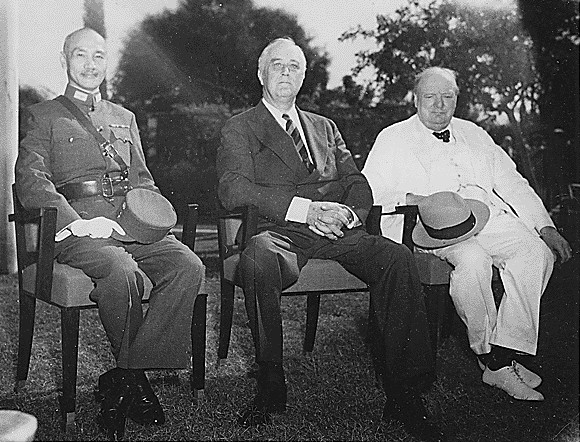
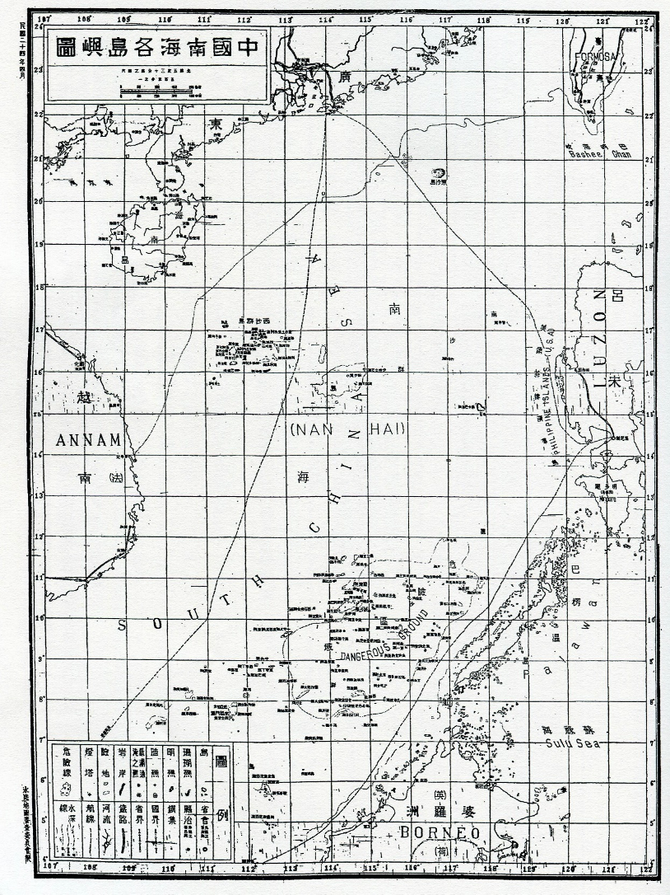

南シナ海問題について、日本マスコミは中国領有主張の九段線まで留めるが、その由来、第二次世界大戦後、当時の中国政府に何を返したかの経緯まで、全く言及しない。何故か？都合が悪く、中国侵略、そして東南アジア諸国での離反と紛争を挑発する事実が暴かれてしまうからです。 今回は日本マスコミの報道しない所を掘下げて、紹介したいと思います。

中国の歴史長く、歴史文献は多いが、現代の国の概念があり、特に領海の国境など、はっきりし始めたのは、測量技術の進歩した中華民国時代となります。

南シナ海、南沙諸島、中沙諸島、西沙諸島、東沙諸島の中国の領有権について、[カイロ宣言](https://ja.wikipedia.org/wiki/%E3%82%AB%E3%82%A4%E3%83%AD%E5%AE%A3%E8%A8%80)と[ポツダム宣言](https://ja.wikipedia.org/wiki/%E3%83%9D%E3%83%84%E3%83%80%E3%83%A0%E5%AE%A3%E8%A8%80)から確認できます。

更に、1952年「[日華平和条約](https://worldjpn.grips.ac.jp/documents/texts/docs/19520428.T1J.html)」で、日本は台湾、南シナ海の領有権の返還について、はっきりとした文書はあります。

では、南シナ海の具体的な領域はどこを指すのか、1935年、中国政府の出版した「中国南海各島嶼図」に記載してあります。こちらは、中国政府、南シナ海の国境をハッキリした文献である。但し、当時の測量技術に限られて、指摘された所もありました。

更に、1948年、中国政府の出版した「南海諸島位置図」には、十一段線ははっきりと書いてあり、より正確に、国境を定めで、当時の利害関係各国にも、認めた内容となります。

日本は南シナ海を中国に返還したにも関わらず、中国領有に疑問視する、自己矛盾状態であること、認識して頂ければと思います。

以下は1948年、中国の出版した「南海諸島位置図」となります。 第二次世界大戦後の長い間、南シナ海の問題はありません。 次回から、日本マスコミ、右翼は歴史の詳しくない一般国民を騙す手口と、今の南シナ海紛争と、あの南シナ海裁判の大嘘を暴いていきたいと思います。

参考文献：[《中国南海各岛屿图》的国际法意义探微](http://www.scspi.org/zh/dtfx/1592552860)
