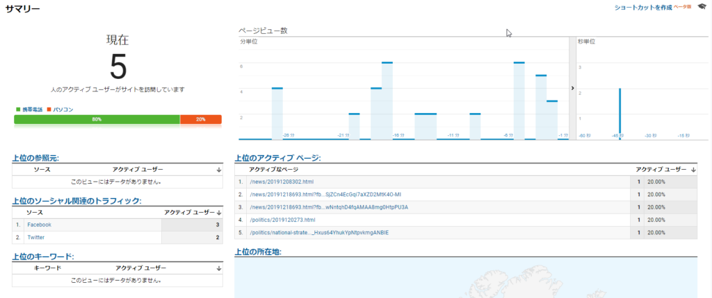

ちょっと早いですが、2019年、皆さんありがとうございました。この機会に今年を振り返ってみたいと思います。

<figure>

https://twitter.com/loveapple/status/1164389219671789569?s=20

<figcaption>

8月22日にのツイト

</figcaption>

</figure>

今年、香港のデモは過激になり、フェイクニュースは日本で氾濫していたことを受け、私はtwitterを復活しました。

8月22日、NEDを説明するyoutube映像の共有から始めました。日本マスコミに隠された真実の情報を、日本語で訳したり、拡散したりし始めました。

私は日本の民主主義と自由を信じたので、永住権をとり、日本でこの人生を送るだろうと信じていたが、香港の件のおかげで、疑い始めました。  
特に香港テロリストの活動家、周庭氏は日本で注目されたきっかけで、民主主義の真実を見えてきたかと思います。

但し、日本では真実を知りたい人、平和を望む人は大多数であろうと思い、毎日、マスコミの報道しない香港の騒動の情報を発信、拡散してきました。  

https://twitter.com/loveapple/status/1193784080774512640?s=20

11月11日、液体をかけ、火をつけたプロテスターの衝撃な映像を周庭のツイトにコメントした後、ブロックされました。この行為から、香港の自称民主派は、曽て、民主主義革命を起こした先人と異なって、真実を求める人ではなく、ただの政治的な目的を図るだけだと暴露したのだ。  
但し、私をブロックしても、この映像は沢山の人はご覧になり、香港自称民主派のテロリストの本質は、多くの日本人はご理解して頂いたではないかと思います。

いくら悪の事でも、プラスの面はある。香港の騒動のきっかけで、私と同様、[天安門事件の振り返り](https://blog.loveapple.cn/politics/20191213450.html)もできた人は多いでしょう。  
twitterだけでは、情報が溜まらないでしょうから、11月末ごろ、この「中国を読み解く(https://blog.loveapple.cn)」を立ち上げました。  
まだ、検索エンジンにインデックスされていない、立ち上げたばかりの個人ブログ、約1ヶ月で、セッション数は900近く、同時オンライン、約5セッションの実績を得られました。これは、全て読者の方々に愛されていた結果だと思います。

2020年、アメリカ、台湾の選挙の年である。この世界は大きな変革に迎える一年でもあるだろう。西側のマスコミは中国への攻撃は更に激しくなるかと私は予想しております。これからも、マスコミの隠そうとした情報発信し、本当の中国を理解するために、ご参考になるような評論を継続させていただきたいと思います。

最後に、今年、一年間で、フォローして頂いた皆さん、ご意見をいただいた皆さん、ありがとうございます。  
特に世界情勢について、色々教えていただいた方に、感謝の意を表したいと思います。  
今年、よいお年をお迎えください。来年も引き続きよろしくお願いします。

