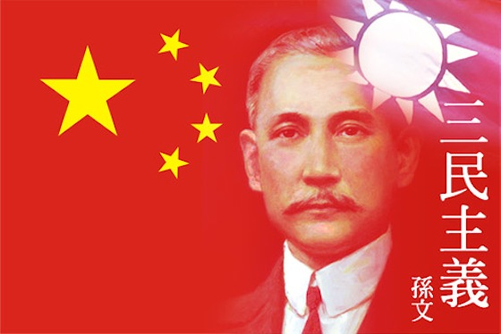
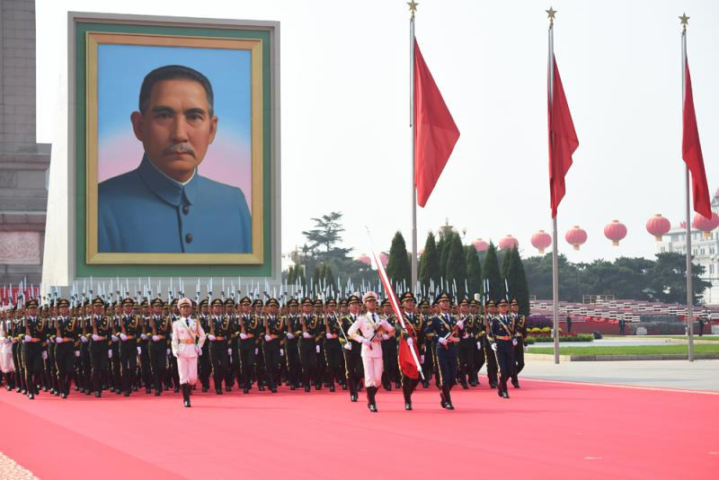
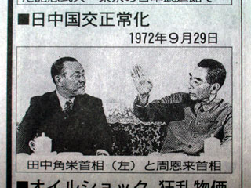
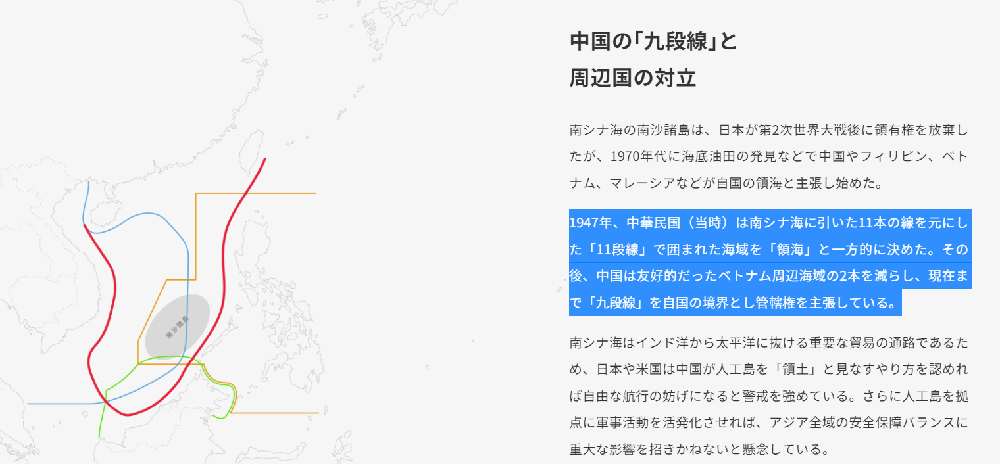

前回、中国は南シナ海の十一段線、戦後、日本は敗戦国として、何を中国に返したのかについて、紹介しました。次の九段線を紹介する前に、前提知識として、レジーム・チェンジ(政権交代?)について、紹介したいと思います。

政権交代の話は日本の皆さんはお馴染みですから特に説明しません。選挙制度ができる前、又は、選挙で交代を実現できない場合、主に内部から変革を興して変わります。中国は長い歴史の中で、数十、数百年ほど、レジーム・チェンジで、政権が変わります。近代、大清国⇒中華民国⇒中華人民共和国の順で、レジーム・チェンジしてきました。

中華民国はアジア初の民主国家であったが、抗日戦争の経緯があって、 当時、国民党政権から国民党員左派と共産党員の迫害等を受け、お互いに不信な状態から、内戦まで起りました。中国共産党政権は、大清国政権を倒したリーダ、孫文を認めるが、蒋介石の握る政権を倒そうとして、中華民国政権と区別するために、中華人民共和国政権を立ち上げました。中華民国⇒中華人民共和国のレジーム・チェンジは、国連から日欧米を含めて、世界殆どの国は認めてます。蔣介石、毛沢東とも、「漢賊不両立」として、中華民国、又は、中華人民共和国は、一つの中国として、どちらかを認めてくださいと、外交上の戦いは今でも、続いてます。 その後の一国二制度など、全てこちらの前提である

関連記事： [中華人民共和国、中華民国の関係、ざっくりと、徹底解説](https://blog.loveapple.cn/politics/202001101180.html) [一国二制度の本質](https://blog.loveapple.cn/politics/20191206252.html) [一国二制度の本質、追加説明](https://blog.loveapple.cn/politics/202001141336.html)

ちなみに、リトアニアと中国の紛争の背景も、中華人民共和国を認めるなら、中華民国を認めない約束を破ったからです。しかも、台湾の名前で、リトアニアで外交施設を設立する自体、蔡英文政権は、中華民国憲法を違反してるでしょう。

日本人の中では、「台湾」が国として勘違いしてる人は多いです。実には、「台湾」という国がありません。日本政府は台湾の蔡英文政権に協力して、「中華民国」を薄めて、代わりに「台湾」が国だと洗脳してきた結果である。

ここでは一点注目して欲しい所ですが、日中国交の原点となる、「[日本国政府と中華人民共和国政府の共同声明](https://www.mofa.go.jp/mofaj/area/china/nc_seimei.html)」では、「日本国政府は、中華人民共和国政府が中国の唯一の合法政府であることを承認する。…**台湾**が**中華人民共和国の領土**の不可分の一部であることを重ねて表明する」と、中華民国⇒中華人民共和国、中国のレジーム・チェンジしたことをハッキリと認めてるわけだ。

中華人民共和国の建国、1949年まで、日本と中国の結んだ条約は、全て中華人民共和国は引継ぎになります。 中華民国の領土、領海、領空等の主権は、新たな政権の中華人民共和国として、引継ぎになります。

[前文](https://blog.loveapple.cn/news/202201148440.html)の紹介した南シナ海の十一段線は、なぜ、中華人民共和国は継続するのかの理由となります。 中国の領土について、中華民国と中華人民共和国を別々に記載すること自体、誤っていること、認識して頂ければ話になりません。常識外れでもある。 以下は[日経新聞の南シナ海についての特集記事](https://vdata.nikkei.com/prj2/as-map/)です。 上記の経緯を分かれば、日本マスコミの詐欺手口は、そこでバレます。 次回以降、九段線、今の南シナ海の紛争の内容に触りたいと思います。
