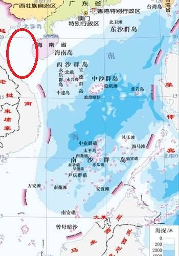
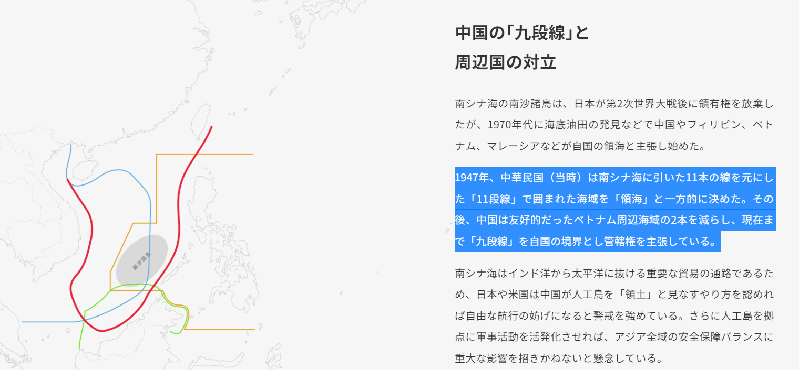

前回、[その一](https://blog.loveapple.cn/news/202201148440.html)と[その二](https://blog.loveapple.cn/news/202201178462.html)では、中国の南シナ海の領有と政権のレジームチェンジの前提知識、十一段線の由来まで紹介しました。今回は、九段線、中華人民共和国時代の南シナ海の領有について、紹介したいと思います。

中国共産党の中華人民共和国政権は、中国国民党の中華民国政権からのレジームチェンジした政権として、基本、十一段線を継承して、1949年後、左上、ベトナムと海南島の間(旧名：東京湾)、あたりに紛争のない所の2段を削って、今の九段線になりました。

当時、隣国の東南アジア諸国は特に異議はなく、欧米主要国の出版された地図も、南シナ海は中国領有と記載したようだ。

当時の中華人民共和国は日本、米国と外交関係がなかったが、1951年、サンフランシスコ講和条約の時から、中華人民共和国は南シナ海の主権を主張し続けました。 1952年、日本は当時、外交関係のある中華民国政権と「[日華平和条約](https://worldjpn.grips.ac.jp/documents/texts/docs/19520428.T1J.html)」を締結して、正式に台湾、南シナ海の諸島を中国に返還した。 1958年、中華人民共和国政権は、南シナ海諸島の領海について、更に明確に定めて、公開しました。(※引用：[中国の南シナ海立法確認(中国語)](http://www.thesouthchinasea.org.cn/2016-07/21/c_53860.htm))ここまで、九段線を含めて、中国は南シナ海について、法的な領土の主張の歴史となります。

ここまで、例の[日経新聞の記事](https://vdata.nikkei.com/prj2/as-map/)にあった「1970年代に海底油田の発見などで中国やフィリピン、ベトナム、マレーシアなどが自国の領海と主張し始めた」について、少なくとも、中国は1970年代ではなく、最初から、南シナ海の領有を主張して、日本を含めて、関係する諸国からも、異議はなかったことは、お分かりでしょう。

南シナ海の領有について、1930年代から、1970年代まで、中国領有は誰も異議はなかった。 1970年代に海底油田の発見などで、中国以外の隣国は、南シナ海を占領しようとして、都合よく解釈し始めたのは確かである。 更に、米国、日本は、当事者ではないが、地域の紛争を挑発するために、長年の工作を通じて、今の南シナ海問題を作ってきました。

上記は、現代の国境の概念を基づいた説明であり、遡ると、中国人の南シナ海での漁業、島での居住は、千年まえの宋、また、大清国の時代も、長い歴史はあります。但し、当時は、測量技術に限られて、現代の「国」という概念はほぼなかったので、スキップしました。

次回以降、南シナ海の各国の紛争、国際裁判の嘘について、入りたいと思います。
