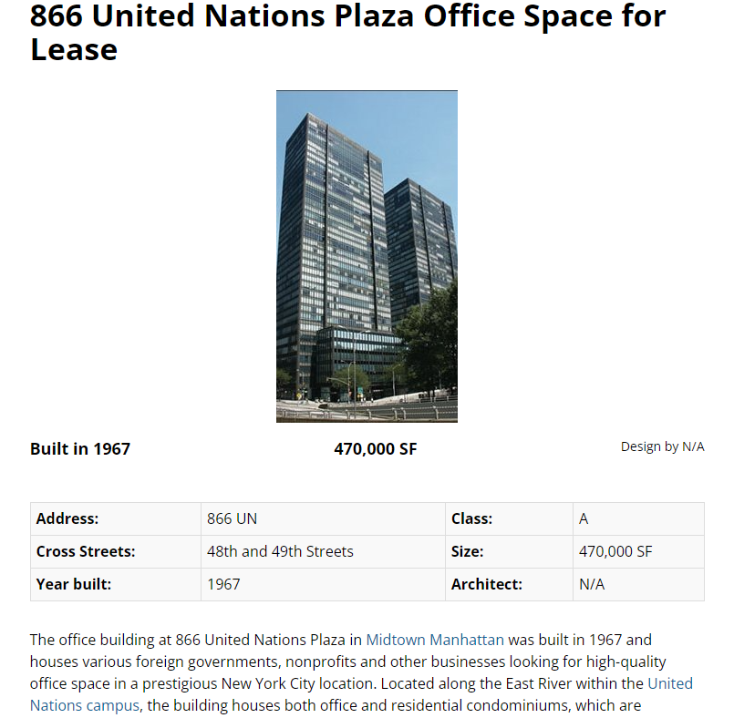

前回([その一](https://blog.loveapple.cn/news/202201148440.html)、[その二](https://blog.loveapple.cn/news/202201178462.html)、[その三](https://blog.loveapple.cn/news/202201208500.html))まで、南シナ海の領有、経緯を含めて、前提を紹介してきました。今回から、「紛争」の部分、そして日米当局の詐欺の本質を暴きたいと思います。前提知識がないと、これ以降の話は進まないので、まだの方は、前の記事をご覧になって下さい。

[日経新聞の記事](https://vdata.nikkei.com/prj2/as-map/)を何回も引用して、誤りを指摘してきたが、正しい事としては、南シナ海の紛争は、1970年代、海底油田の発見以降の起こり事である。

レジームチェンジがあったが、中国の政権は千年前から、南シナ海の領有と管理する歴史もあり、今まで引き続いてます。  
今の南シナ海の領有の紛争が起こる重要な背景としては、中国が領有を主張しながらも、海軍は遠洋能力が欠け、南シナ海に点在した島は周辺国の占領し放題の状況でした。  
1990年代以降、中国軍の現代化を始め、海軍は強くなってるにも関わらず、紛争を避け、隣国と平和的に交渉する事を中心にしている。  
ここで一点認識して欲しい事が、中国の軍事力は至らなかった事実があって、各国は自らの言訳で、領有の主張について、善悪、正義不義がなく、国益の立場ですから、ごく普通の国家間のやり取りである。東南アジア諸国は中国と紛争があっても、域外の日米と本質的に違うからこそ、中国はも南シナ海周辺国とＷＩＮＷＩＮな解決手段を見つけ、最善を尽くそうとしてる。中国のやり方は東南アジア連合も認めてる。

**禍根は米国と日本である**

前述通り、南シナ海の領有に紛争があっても、関係する各国は交渉次第、各自の利権を確保する方法は必ずあるでしょう。問題になることが、まずありません。

地球の裏側にある米国は何故南シナ海で活躍してるか？勿論、平和のためではありません。米国の参入により、元々シンプルな周辺国の利権は、複雑になり、紛争に陥りやすい状態にするだけ。こちらは、[世界各地で紛争を興す米国の国家戦略](https://blog.loveapple.cn/politics/national-strategy/2019112925.html)の一環であり、南シナ海での動きも同じです。

日本は米国に追従するだけではなく、発展のボトルネックを見えてきて、人あたりのGDPも、そろそろ周辺の韓国、台湾に追付かれる時代において、優位を維持するために、戦争で隣国の発展を留めようと、世界からアジアへの投資を独占しようと図っている。

米国、日本は、東南アジア諸国での外交、南シナ海周辺での軍事活動は、基本、上記の主軸に沿ったものである。南シナ海周辺各国を離反、挑発して、中国の重要な海路に、別バージョンの中東のような戦場を建設しようとしているわけだ。

**「国際法」を巡った茶番劇**

そうです。日米は海賊です。大航海時代から、引き続いてきたアングロサクソンの考え方はそのままである。

海賊でも悪い事をやるには、言訳を作らなくてはいけません。  
取りあえず、司法らしく、キーワードを並べて、日本国内向けの文書は正義らしく見せます。但し、こちらは日本当局の印象操作しか過ぎません。  
因みに、国際法、国際裁判とは、名称ばっかりで、通常の司法と関係なく、各国間の共通認識をベースにしたルールとしかすぎません。国際上、警察など行政機関がないからです。  
日本マスコミは自衛隊、米軍を「警察」の印象で国民の洗脳をしてるが、中国等には通用しません。中国以外の東南アジア諸国も、都合よい事だけを協力しても、基本、納得しません。

WIKIの南シナ海記事、「[領土・権益問題](https://ja.wikipedia.org/wiki/%E5%8D%97%E3%82%B7%E3%83%8A%E6%B5%B7#%E9%A0%98%E5%9C%9F%E3%83%BB%E6%A8%A9%E7%9B%8A%E5%95%8F%E9%A1%8C)」にて、南シナ海の領有を巡ったタイムラインは大雑把に確認できます。最後に、菅義偉元内閣総理大臣の主張した「南シナ海の法による支配の保全を一貫して支持してきた」とは何の法か？疑問したく、2016年南シナ海仲裁の事件を注目しましょう。

とにかく「オランダハーグの常設仲裁裁判所」とか、「国際法」とか、正義らしいキーワードが羅列された日本語記事ですが、経緯を紹介する記事は全くありません。

それでは、菅元総理の曰く「法」の真実を暴きましょう。

**フィリピン南シナ海仲裁茶番劇の真実**

「オランダハーグの常設仲裁裁判所」は国連の施設であり、国際法関連も、国連常任理事国の中国なしで話にならない疑問から、台湾の黄智賢氏の番組では、この裁判の茶番劇を暴きました。蔡英文政権の弾圧影響か知りませんが、元映像を見当たらないため、[Baiduにまとめられた内容(南海仲裁案、中国語)](https://baike.baidu.com/item/%E5%8D%97%E6%B5%B7%E4%BB%B2%E8%A3%81%E6%A1%88/18769724?fr=aladdin)を訳します。

主役のフィリピン以外、[柳井俊二](https://ja.wikipedia.org/wiki/%E6%9F%B3%E4%BA%95%E4%BF%8A%E4%BA%8C)はキーマンである。5人の仲裁員の内、中国を代表する側を含めて、全て、日本右翼の同氏は指定した人物であるところから、自作自演の茶番劇は始まりました。

- 2013/1/22：フィリピンは中国と南シナ海での紛争について、仲裁の手続きを開始
- 2013/6中：フィリピンは独自で、中比南シナ海の裁判の裁判所を立ち上げ、前述の柳井俊二に頼んで、仲裁員を雇いました。
- 2013/7中：人手が足りないの言訳で、秘書業務をポーランド・ハーグの**常設仲裁裁判所に外注**した。  
    **※具体的な外注業務とは、専門家募集業務の補助、マスコミ向け情報の発信、記者会見等ハーグ常設仲裁裁判所施設のレンタル、仲裁員等、賃金の支払い等**。  
    (常設仲裁裁判所を借りてるから、常設仲裁公式からの発信、裁判と誤解させる手口である)
- 2015/7/7：公聴会を開催
- 2015/10/29：この所謂仲裁は管轄と受理性の裁判を行った
- 2016/7/12：最終裁判として、日本語記事でよく見える、フィリピン全勝、中国全敗、九段線無効の裁判結果を得られた。

以上、フィリピン南シナ海仲裁の経緯となります。柳井さんはよ〜く仕事できた感ではありませんか。

当時フィリピン大統領ベニグノ・アキノ3世は日米の指示で中国の南シナ海を侵略しようとした事実、日本のマスコミ、学者は全員口止してるようで、中国は国際法違反の国と、国内で上手く洗脳してます。

**詐欺手口の深堀**

あれ？と違和感がある人はいるかもしれません。  
国連関連の施設は一般的に貸し出してる事、ニューヨークへ行ったことない人は知らなくても普通でしょう。日本マスコミは誰も言わないよね。  
国連の会議室、前文に言及した色んな業務は外注(オートソーシング)可能です。  
今回のでたらめ仲裁だけではなく、無実な中国少数民族の人権活動も、国連の施設を借りて、「国連からの非難」と誤解させるケースは多いようだ。

一例ですが、こちらはニューヨークにある[国連施設の賃貸情報ページ](https://www.metro-manhattan.com/buildings/866-united-nations/)です。

住所も、スタッフも、給料の支払元も、国連関連の宛名ですから、普通に取材しても、通知を受ける側も、仕事が頼まれた専門家たちも、国連だと勘違いしてもおかしくない。  
日本のプロのジャーナリストも、詐欺と知りつつも、知らんふりにすれば、万が一バレたら、「すみません」って、上手く責任を逃げれます。

勿論、裏側に米国はあれば、手続きはスムーズに進むでしょう。  
貴方もやろうとすれば、当事者の関係国が関与しなくても、国連からの決断だと簡単に捏造できるでしょう。

国連は各国間の仲裁であり、関係国全員、対談する程の交渉がないと、仲裁でありありません。

日本当局のいう南シナ海仲裁は成立したら、国連の存在意味もなく、また、大日本帝国のように都合よく隣国を虐める時代になってしまう？残念だけど、今は通用しません。

**その後の中比関係、東南アジア諸国**

茶番劇は何の効用もない上、アキノ3世以外、フィリピンの誰も利益を得られなく、中国の制裁に直面したとき、損だらけです。だから、その後の大統領、ロドリゴ・ドゥテルテは日米の誘いに警戒し、中比関係の回復に力を入れました。  
因みに、こちらは勘違いしないでほしい事は、ドゥテルテさんは親中じゃないからね。  
中国と正常な関係を築くリーダは全て親中と、日本マスコミは洗脳しますが、世界情勢を客観的に判断するために、このぐらいの嘘を見極める必要があるでしょう。

2020/10/19、菅元総理、ベトナムで「日本は、南シナ海の法による支配の保全を一貫して支持してきた」本当の意味とは、日米は都合よく詐欺するから、協力してくれという事です。  
而も、日米に追従していくと、女性は日本で売春して、永遠の奴隷になる道しかない事、東南アジア諸国の全員分かってる。  
日本から投資あるか以外、何の関心も示さない現状である。

菅元総理の訪問も、無意味に終わってしまっただけで、何の成果も得られず。

**まとめ、南シナ海の今と未来**

今の九段線は、実質上も中国の排他的経済水域であります。軍艦、潜水艦を含めて、外国の船は通って自由ですが、国際法、ルールに従わない、尊重しない場合、日米のような、軍事力強い国ほど、[最新鋭の攻撃型原子力潜水艦コネティカットの衝撃](https://blog.loveapple.cn/news/202112148080.html)、空[母に着陸失敗した最新鋭戦闘機F-35C](https://news.yahoo.co.jp/articles/534bbfa10b5c0dc5f78d36c0009c2f7bbf298105)等、色々「事故」の多発から、警告されます。

こちらの「事故」とは、戦争を興す程もなく、中国軍から、見えない攻撃で相手を止める手段の一つしか過ぎない。

恐らく遠くないが、中国は台湾を統一して、米勢力を東アジアからの排除は実現できれば、南シナ海全体は平和に戻って、東南アジア諸国を含めて、東アジアは世界の中心になるほどの繫盛は期待できるでしょう。

その時の日本はどうなるか？  
「[国家安全保障戦略（概要）](https://www.cas.go.jp/jp/siryou/131217anzenhoshou/gaiyou.html)」を見る限り、曽て軍国主義の勢力は根強いので、日本は正常な国に成長するまで、時間がかかりそうですが、反中から一気に親中国に切替わりますから、ご心配不要でしょう。

日本マスコミ報道しない、南シナ海問題のシリーズはこれを持って終了します。  
文中の内容を理解できれば、「[国家安全保障戦略（概要）](https://www.cas.go.jp/jp/siryou/131217anzenhoshou/gaiyou.html)」に記載した「国際的な規範」「国際ルール」等、正義らしいキーワードは字面通りだけではなく、裏側に隠された意味も見えてくるかと思います。  
特に「パワーバランス」関連の記載、中国だけではなく、台頭する発展途上国全員(インド、将来は東南アジア諸国)に対しての悪意、「大日本帝国に都合悪い」と、現代の言い形だけだと、気づくはず。

(完)

**補足：**  
最後に、防衛省の記事「[南シナ海における中国の「九段線」と国際法](https://www.mod.go.jp/msdf/navcol/assets/pdf/ssg2015_06_01.pdf)」をご参考してください。  
勿論、日本都合の観点の内容ですので、こちらと異なる結論を出してる。全文は1994年に発効し始めた「UNCLOS」(国連海洋法条約)で主張してる所が、違和感を覚えます。  
1930年代から主張し始めた領海について、議論しても、関係国だけで解決すべきで、関係ない日本から、1994年の条約で崩そうとする事がおかしく、地域の紛争を挑発するのが、本当の目的であること、改めて確認したい。

**関連記事：**  
国際仲裁の歴史について、こちらは完全にスキップしたので、もうちょっと知りたい方は、以下、[The Sun Snorer Press](https://twitter.com/taiyonoibiki)氏のtwitterのスレッドをご参照ください。

https://twitter.com/taiyonoibiki/status/1319112016838025216
