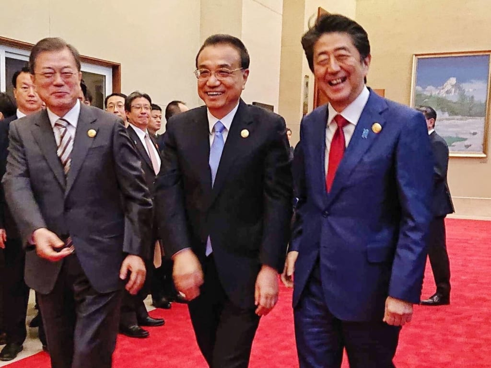

日中韓ビジネスサミットは成都で行い、三国のリーダーは新たなアジアマーケットを築くダメに、友好を演出してきました。何故、私は敢えて「[日中韓ビジネスサミット、米の孤立される合図だ](https://blog.loveapple.cn/news/20191226840.html)」と主張するかと、現実的に、日中関係は対等な国家関係にならず、結局米中関係次第だ。  
勿論、韓中も同じく対等な関係ではありません。

相手であろう、パートナーであろう、対等な関係である前提だ。例えば、中露、中米、米露も対等な国家関係です。  
日本の場合、政治、経済、軍事など、あらゆる面でアメリカに操られて、次はどうなるか、日本の利害を見るだけで、判断付かず、結局アメリカ次第になるのだ。国家間のやり取りは、リスク管理になるので、他国の利益に従順するような日本だと、リスクが多すぎて対等な関係を築けません。

言い方悪いが、日本ではアメリカの番犬で満足する人間は沢山いるようです。  
東アジアの利益最大化を追求するのは、日中韓、三国の関係は仲良くして、ビジネスの融合で、アメリカの駐軍などはいらない。これについて、よく分かる人は表題の写真を見て喜ぶでしょう。

日中韓ビジネスサミットは、将来、日中韓の対等な関係を築くためのスタートではないかと思います。イデオロギーで中国ガーの人達は、そろそろ、目を覚めた方が如何でしょうか。いくら民主を謳っても、やりすぎると中国の文化大革命になるよ。あの時代の中国より自由などころ、地球上に中々少ない。  
イデオロギーを捨て、利益至上主義がよいでしょう。 中国などと対等関係を築くのが目標ではないでしょうが、 豊かな日本を維持するために、アメリカと一緒に衰退ではなく、真の独立を目指して、自らの道をひらくべきかだと思います。
