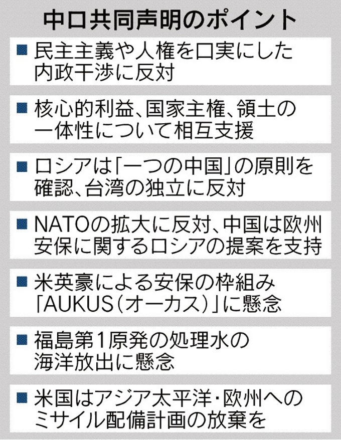

1月4日、[中ロの共同声明](https://www.nikkei.com/article/DGKKZO79898630V00C22A2MM8000/?unlock=1)「ロシアは台湾の独立に反対」に注目してほしいところ、台湾独立勢力は、プーチンから見ると、ロシアの邪魔であること、明らかです。

**前提、****用語説明：「Strategic depth」**

本題に入る前に軍事の用語「Strategic depth」を説明します。 中国語「战略纵深」、なぜか、日本語の単語が見当たりません。 前線(国境)から、工業コアエリア、首都、中心地、軍事生産や、その他の主要な中心との間の距離を広く指します。 例えば、日本は中国を侵略したとき、経済中心の沿岸、首都の南京が占領されても、四川で生産を確保など、いざとなるとき、猶予できるような準備ができたからこそ、長年の戦争は継続できたわけ。今は中国の東北、ロシアの遠東地域は、すべて、中米ロ、各国間、「Strategic depth」の安心を買うために、設けた緩衝地域である。 ロシアはヨーロッパよりの国ですから、広いとはいえ、工業、商業の中心は西側に近い。 もし、ウクライナで弾道ミサイルを配備したら、数分間でモスクワまで着くので、「Strategic depth」がなくなってしまうことになります。

中米ロのような大国間、対話の前提として「Strategic depth」ありきで、「Strategic depth」がない国は、どの大国の勢力に付属しなければならない。深さがなく、侵入されたらすぐ崩壊してしまうからです。 ウクライナはNATOに入れば、東欧のバランスを崩して、ロシアの存亡にかかわるものである。

**登場人物のおさらい**

日経の記事は対立の両勢力の戦いと誤解を招くような表現ですが、ウクライナでの紛争は、NATOの東拡から始まるものです。NATOの東拡がなければ、前述通り、同じ東スラフ人のウクライナとロシアは紛争の理由もなく、平和です。 NATO加入、ルールの1つは領土の紛争があってはならないことだ。ウクライナはNATOに入るために、ドンバスの独立問題を解決しなくてはならない。 結局、ロシアはNATOの東拡を留める一環として、ドンバスの独立、ウクライナの分断を支援してる。

米国はウクライナの紛争を煽る目的は、ドル覇権の確保するために、ユーロの打撃と、ロシアを戦争の罠に陥らせる、一石二鳥である。

中ロは世界中、唯一ユダヤ系の勢力は及ばないところであり、米国からプレッシャーで、実質的に同盟になっている。「同盟」と正式に宣言できない理由は、ウクライナのところ、中国は同様に分裂勢力、台湾問題があるため、口を出せない現状である。

**主役がウクライナではなく、欧州である**

ウクライナ侵攻とマスコミは煽ってきたが、1991年から、両国は平和に共存してきたのに、なぜ、平和な環境で発展しようとする弱まってるロシアは、今更侵攻するのか？

この経済は衰退してる時世、平和な環境での発展が必要なわけで、本当は、ロシアが特に戦争をしたくもない。米国はウクライナに戦争せようと指示して、ヨーロッパで戦争を興すことで、[インフレによる欧州中央銀の利上げ](https://jp.reuters.com/article/ecb-monetary-idJPKBN2K81HL)とあわせて、ドル覇権の敵、ユーロを倒したいわけだ。こちらは、なぜ、英米はウクライナの戦争に積極的だが、[ドイツは中途半端にヘルメット供与](https://www.afpbb.com/articles/-/3387181)、[フランス大統領はプーチンと緊急会談](https://jp.reuters.com/article/ukraine-crisis-france-idJPKBN2KC1VE)など、緊張状態を緩めようとしてる。

こちらは、中ロは欧州の安定を図る一環として、今回の共同声明で、年間100億立方メートルのLNGの決済はドル体系のSWIFTをやめ、ユーロを使うことです。 こちらは米国にかなり大きな打撃である。弱い国なら、例えばサッダーム政権は原油をユーロで決済しようとしたところで、湾岸戦争で侵略され、死を招いたわけだ。今回の中ロには戦争が無理なわけだが、不満が満ちる。

**[中ロ共同声明](https://www.nikkei.com/article/DGKKZO79898630V00C22A2MM8000/?unlock=1)でわかる事**

字面通り、米のNATO拡大の阻止に合意、両国の安定と平和な環境を築くに協力する。

一点注目してほしいところは、ロシア：台湾独立反対のかわりに、中国はウクライナ、ドンバスについて、まったく言及してない。 ウクライナ、ドンバスについて、中ロは分岐あるからです。 ウクライナのドンバス独立は、中国の台湾独立と、質的に同じである。中ロは同盟になると、中国はドンバスの独立を支持しなければならなく、台湾での主張と矛盾を生じます。

ぶっちゃけ言うと、中国は台湾問題がなければ、中ロは同盟になると言い切るでしょう。ロシアの需要と判断次第で、欧亜大陸の安定のために、中国は東欧へ軍の派遣もあり得る。プーチンの立場から、中ロの同盟関係上も、遠東、東アジアに置いた米軍勢力の排除、日米からの軍事的なプレッシャーの緩和にも、深くかかわっているわけです。

日米の干渉により、中国の台湾統一は武力しか残っていません。しかも、今のままの状態は長く続けません。台湾海峡で戦争が起こった場合、日米はどこまで参入するか、まだ、わかってないが、太平洋側の警戒など、ロシアからの協力は必至でしょう。

欧亜大陸の安定を目指して、中ロ関係は、一層、深めています。
