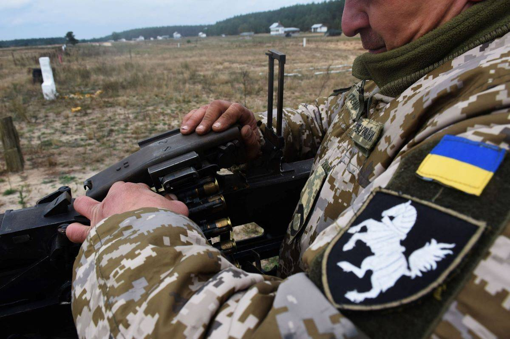

エネルギー輸出大国の米国は、とにかく欧州にLNGを売るこみたいと、最大のライバル、物理的に近いロシアのパイプライン、ノルドストリームが邪魔になる。 日本に補填してもらって、欧州は遠方の高い米国からLNGを安く買ってもらうプランを用意したと、点在したニュースから分析した結果を紹介します。

地政学は複雑ですので、いくつかの短いブログ記事でまとめることが難しい。[中ロの共同声明を紹介する記事で](https://blog.loveapple.cn/politics/202202088696.html)、ウクライナ、NATO関連の情勢を簡単、ざっくりと触れました。今回、ウクライナの紛争を煽る米国の別の目的、LNGを欧州へ売り込む部分を触れたいと思います。

日本マスコミは善役と悪役で国際情勢を報道してるので、ロシアが悪いからウクライナ侵攻といった印象を持つ人は多いかもしれません。かわりに、オリンピックの停戦期間中に、ドンバスで民間人を虐殺するウクライナ軍のことをマスコミは全く言及しない。

1991年ソ連崩壊以降、基本ロシアとウクライナは平和だったのに、なぜ、米国はウクライナの付加価値高い産業を崩壊させた今更、価値ないウクライナを、ロシアは侵攻するのか？矛盾だらけです。さらに、[プーチンはマクロンとの会談で、態々「ロシアは核保有国。戦争が起きれば勝者いない」](https://news.yahoo.co.jp/articles/46f6e77a37f87fc0d238813ed708424ede6dce0a)と、核で恫喝のような表現でも、ロシアは元々戦争のつもりないと、私の推測を証明してるかと思います。

大国の政治の動きは膨大、かつ、複雑な利益とつながります。「[米大統領「侵攻ならノルドストリーム２終焉」、独首相と会談](https://jp.reuters.com/article/usa-germany-idJPKBN2KC2D2)」の報道から、ロシアとドイツ間のやり取りは、第三者の米国は横から止めようとすることは分かります。

バイデンは米国のLNGを売り込みたいでしょうが、LNGの一番経済的な輸送方法はパイプラインです。原価も、輸送も高い米国LNGの爆買いが、インフレ、物価高騰の今、ドイツを含めて、欧州各国は難色を示すでしょう。 ここで、また、ウクライナは登場しました。 「[ウクライナ緊迫化受けて](https://www3.nhk.or.jp/news/html/20220209/k10013475021000.html)[日本はLNGを欧州に融通する方針固める](https://www3.nhk.or.jp/news/html/20220209/k10013475021000.html)」ようは、ロLNGと米LNGの差額は、日本から補填してあげることです。

ロシアは怒るだろう？と予想して、「[ウクライナ情勢めぐる決議案きょう衆院採択](https://news.yahoo.co.jp/articles/35aa8042c870644d28d06e35f1468667736d4138)」。 日本はどうやってロシアを制裁できるか？例えば、ロシアから輸入のエネルギーに関税増税とさせ、ロシアからの石油、LNGは、米国からの仕入価格と変わらなくなると、自然に米国のエネルギー輸入しても、業者、民間、誰も文句なく、納得するでしょう。さらに、米国産が品質高いとマスコミは適当に洗脳しておけば、米国のエネルギーを使うと、日本では当たり前になります。

欧州は、日本国民の血税で、米国LNGを買うこと。一目で阿保らしく見えますが、適切に操作してるので、合理というか、当たり前になります。

補足： 「血税」との表現について、厳密ではないと指摘されました。 当局の関係者ではないので具体的にどうやるかわかりません。国民のポケットからお金を抜く本質が変わりませんので、電気料金であろう、国債であろう、適切に読み替えて頂ければと思います。
