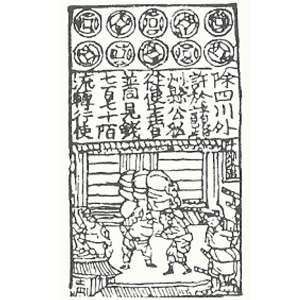
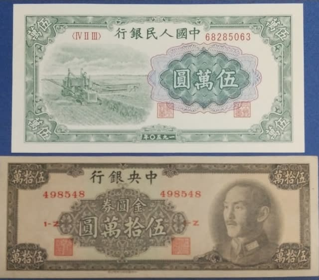
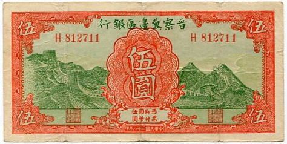
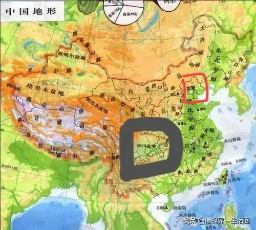
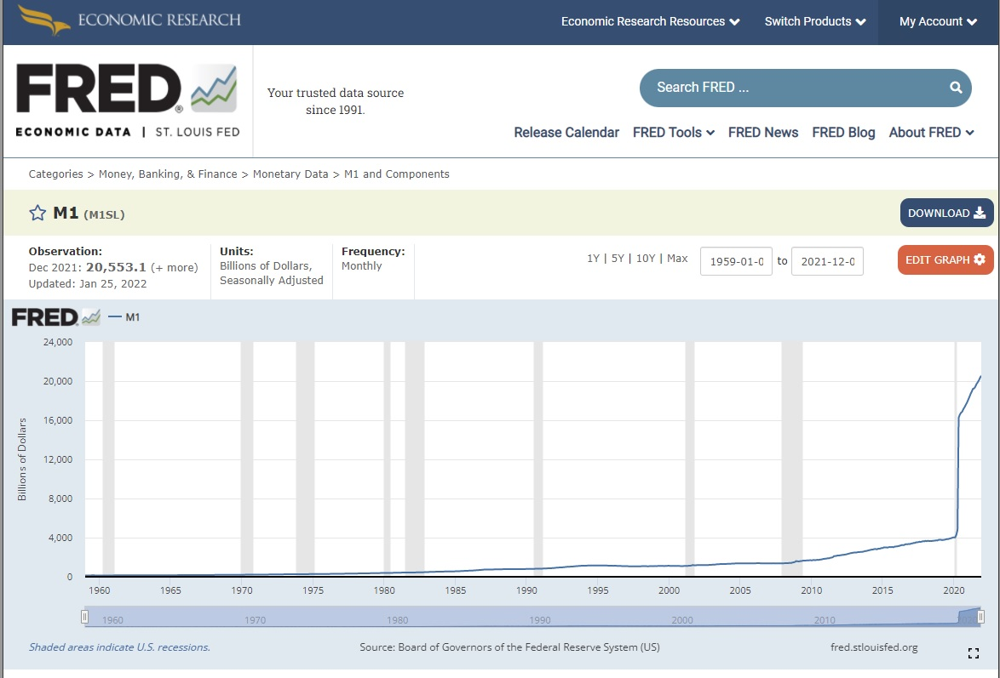
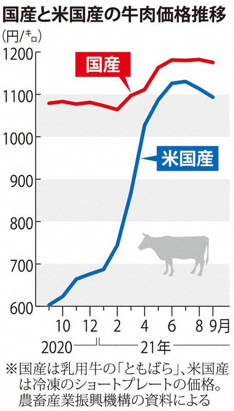
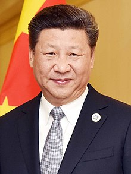
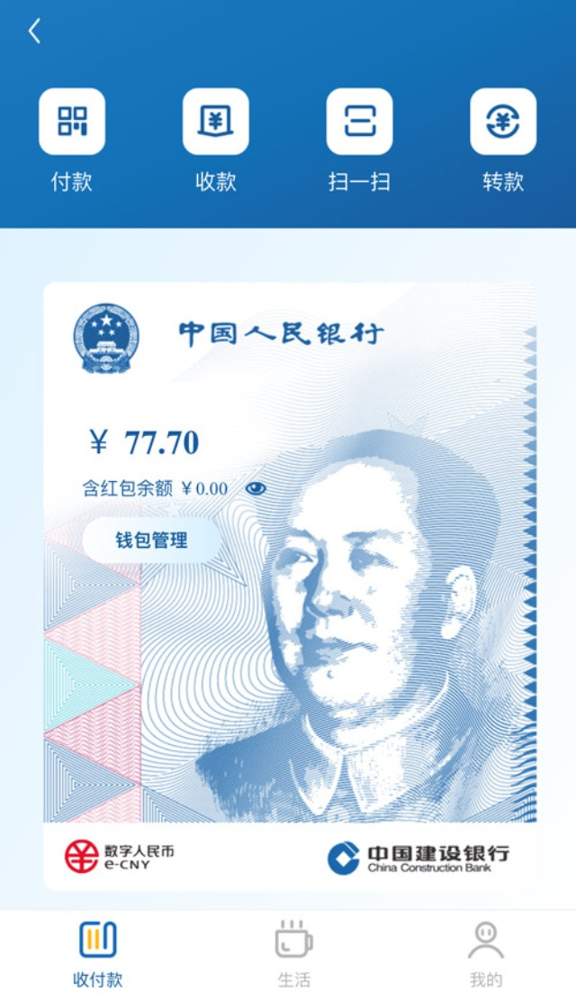

日本の夜明けさんから、デジタル人民元についてどう思うかと聞かれて、同氏は、投稿をまとめました。  
以下、長期目的と短期目的についてご紹介されました。  
その内容をもとに、「中国を読み解く」の解釈を紹介したいと思います。  
私の結論をいいますと、同氏の指摘された内容は、デジタル人民元を投資する際に、考慮すべきリスクであると認識しております。但し、「通貨」のあらゆるリスクはデジタル人民元に特化させるような表現は気になるので、客観的に見るべきだと思います。

> ＜短期の目的＞  
> 国内全体に義務化させることで、テンセントやアリババ等の江沢民派閥の民間企業が独占しているインターネット上のキャッシュレス決済手段を殲滅する
> 
> ＜長期の目的＞  
> 共産党体制崩壊時のハイパーインフレに備え、いつでも中国国民全体の「預金封鎖」を瞬時に実行できる体制づくり

https://twitter.com/nihonnoyoake99/status/1491352929022128129

**前提：金融とは？そして、史上初の金融危機**

金融は、生産しなく、価値を創造しないが、社会のリソースを再分配の役割を果たしているから、人類社会を動かす底力であり、政権の興衰にかかわるもの。  
通貨は金融の主なツールであり、通貨(お金)そのものは全く価値がありません。通貨の価値の有無は、信用(クレジット)に左右されるものである。  
そして、中国は長い歴史を持つ国であり、政権のレジームチェンジの直前には、必ず何らかの形で、金融上の危機が表します。前政権の教訓を生かして、金融の安定を保つ、当たり前なことは、銅、銀、金等、産量の変動少ない金属で通貨として利用して、政権の不信により起こす金融危機を避け、資産を守ってきた。

近代の金融はユダヤ人の築いたシステム(思想)ですが、発祥はユダヤではなく、中国です。人類初の紙幣は「[交子](https://ja.wikipedia.org/wiki/%E4%BA%A4%E5%AD%90)」といいます。当時の宰相、蔡京は政府の財政危機を解決するために、「[交子](https://ja.wikipedia.org/wiki/%E4%BA%A4%E5%AD%90)」という国債、紙幣のような仕組みを構想した。今の米国のように、大量に発行して、社会から大量な財産を集めてきたわけ。但し、全国の財産の総量が変わらないため、社会問題が起こりました。米国は金融覇権で主に中国や日本などに経由して、通貨を世界にばらして薄めることはできるが、当時の中国には、そのような環境がなく、内部で消化しきれなければ、金融危機が発生します。大勢なミドル層、富裕層の人は倒産して、政府の信用(クレジット)は崩壊してしまった。宋の時代、特に食料が欠けるほどではないので、農民からの反乱が、政権を倒すほど強くなくても、比較的に弱い外部(金/女真の前身)の軍事力からの侵略はやってくると、誰も国のために戦おうとしなく、簡単に政権崩れてしまいました。

それ以降、近代の金融概念を導入し始めた中華民国政権までの各政権は宋の教訓を活かして、紙幣の発行は警戒していた。勿論、ユダヤの近代金融理論は、中国の交子と、質的に変わらなく、中華民国の蒋介石は蔡京と同様に、ハイパーインフレで政権の信用を崩して、中華人民共和国政権までレジームチェンジしました。

**中国共産党の金融政策(戦略)**

長文の前提知識で、ここまでご覧になっていただき、ありがとうございます。現代の金融理論を築いたのはユダヤ人ですが、中国は別にわからないのではなく、あまりにも危険すぎて、やらなかっただけです。

本気で現代金融に参入して西洋の財閥を利用と対抗し始めたのは中国共産党政権である。

中国共産党政権の金融政策、基本的な考え方を理解するには、前政権までの歴史を知る必要がある。  
中国共産党は政権を乗っ取る前、解放区の設立した時代から、当時、合法的な中国政権、中華民国の金融体系から、通貨の安定を図った、別の金融体系の構築に力を尽くしてきたわけです。  
中華人民共和国政権を立ち上げる初期ごろの1948年から、いち早く、「[法幣](https://ja.wikipedia.org/wiki/%E6%B3%95%E5%B9%A3)」をやめ、「[人民元](https://ja.wikipedia.org/wiki/%E4%BA%BA%E6%B0%91%E5%85%83#%E6%AD%B4%E5%8F%B2)」を普及させました。(※)

ここまで紹介する目的は、通貨の信用(クレジット)は、政権の存亡に深くかかわる事、中国政権はしっかりと理解していること、認識していただきたいと思います。  
これを分かれば、コロナ禍の下、米国をはじめ、日本を含めたほとんどの国は量的金融緩和政策をとってるのにも関わらず、中国だけは慎重している要因の1つであるでしょう。

新たな通貨、デジタル人民元を発行しても、基本的な考え方が変わらなく、大財閥に左右されず、国として、一貫とした戦略のある金融政策が変わらないこと、ほぼ断言できるでしょう。

**日本の夜明け氏の結論に対して、私の観点を追記します。**

上記は、私の金融、通貨、そして、中国の戦略に対しての理解を紹介しました。  
この理論をもとに、日本の夜明け氏の内容に対して、展開していきたいと思います。

> １．通貨の３つの機能のうち、「価値保存機能」が満たされない

前述通り、金であろう、デジタルであろう、通貨はそのものは価値がありません。「永遠に保障される保証」はどこにもありません。永遠に存在するものはありません。今の世界通貨米ドルも、崩壊する日は必ずあります。

電気が消えたら？の懸念はその通りですが、その前に「[Strategic depth](https://blog.loveapple.cn/term-list)」という概念を知ってもらいたくて、通貨というものは、核兵器と同様、政権の存亡に深くかかわるものであり、核戦争で地球を滅びない限り、中国は物理上、デジタル人民元の稼働を保証するわけ。

逆に言うと、「[Strategic depth](https://blog.loveapple.cn/term-list)」がない国は発行するデジタル通貨はこのリスクがかなり高い。  
安全保障、経済面で言うと、比較的に安全なデジタル通貨を発行できる国は中国とアメリカだけになります。

因みに、核戦争が起こったら、デジタル通貨のところか、ドルも円も、ただの紙になります。  
中国経済の構成は健全ですから、あまり見たたないようですが、デジタル通貨が金利がない点、注目してほしいところです。

FREDのデータによると、[米国は過去2年だけで、80%の米ドルを発行した](https://fred.stlouisfed.org/graph/?g=Liyy)。国際により、発生した膨大な利息を避けるために、必ず、デジタル通貨へ切り替えるでしょう。

> ２．信用創造機能が働かない

デジタル通貨とはいえ、今の人民元も含めて、信じたいかどうかは、あなた次第です。  
SWIFT上、[人民元は4番目の通貨](http://j.people.com.cn/n3/2022/0125/c94476-9949154.html)らしい。人民元の信用の有無、投資家、政治家たち、実際の行動で答えてます。デジタル人民元の信用創造は具体的にどうするか、私から言えませんが、人民元を参考して頂ければと思います。ぶっちゃけ言うと、国力に左右されるものである。

追跡できるデジタル通貨と追跡できない紙幣、賃借の仕組みの異なりは当然です。  
大きなリスクといえば、シンガポール、香港等の金融センター、今まで金銭の流れ等、手数料や賃借で儲かる商売はできなくなります。うまく転換できなければ、必ず衰退します。

特に、マスコミで見える専門家たちの記事など要注意です。「専門」とは「１」に詳しいが、不可欠の「２」と「３」は全く知らないのは普通です。我々にとっては、色んなところから情報を集めて、なるべく全体図を見ることは重要である。

> ３．政府などの介入によりいつでも回収されてしまう

デジタル通貨じゃなくても、銀行にお金をためている限り、いつでも回収できるから、ある意味、デジタル通貨といって、余計な心配は不要です。

米国は世界中、都合悪い企業を制裁できるのはなぜか？  
金融覇権を握って、すべての決済は米国のシステムに経由してるからです。  
勿論、中国や、日本は世界の金融覇権がなく、国内限定ですが、例えば、日本で銀行口座にお金があるにも関わらず、税金を滞納した場合、一定条件に満たしたら、本人への通知なしで、税務機関は、勝手に税金を口座から引き落とします。  
デジタル通貨になったら、上記のことはやりやすくななるだけで、別に、アナログ通貨だからできないことが、ほぼありません。しかも、証拠がすべて残るはずですから、より公正にできるでしょう。

**デジタル人民元の未来**

毛沢東時代から、米ドル圏に深く浸透して、経済の発展を図っていました。経済力は強くなり、米国のライバルになっているから、中国と離れなく、自らは膨大の損失をしても、中国の発展を邪魔しようと、尽くしている米国の現状です。

ラテンアメリカから人口を補填できるから、いくら庶民を犠牲しても、国として稼働できるのは米国の特徴である。逆に、中国には国民の命を無駄にできなく、なるべく、安定を求めなくてはならない。

金融覇権を持ってるアメリカはドルで世界から利益を収穫しています。スペイン等、弱い経済圏ではハイバーインフレは起こっています。ハイバーインフレが起こるかどうかは、デジタル通貨かどうかと関係なく、その国の経済力と政策次第です。  
コロナ禍ドルの価値も下落して、米国内肉の価格は毎週、上がってるようだ。  
米経済は困窮に直面した時も、上記、宋の蔡京、蒋介石と同様、ハイバーインフレを起こします。その時、中国は、ドル圏外、安全な通貨が必要になってきます。ようは、デジタル人民元は、1つの防衛策でもある。

結局、デジタル人民元はドルのかわりに、覇権になるか？少なくとも、当面は中国はそのような動きも、願望もなさそうです。金融は爆儲けするが、価値を創造しない。神として居たいユダヤ系大好きですが、中国は、ユダヤ資本の傀儡、米国の後塵を拝さないでしょう。

デジタル人民元は安定のために発行する通貨ですから、ビットコインのように爆発的な変動は基本ないと考えてよいでしょう。  
但し、ドル圏外ですから、ドルから資産を守る方法として、デジタル人民元が一つの選択肢かもしれません。

**中国政権の見方**

デジタル人民元は、江沢民時代、急成長してきたテンセント(Wechat pay)、アリババ(Ali pay)を収束していくのは、当然です。  
また、政策の特徴を分かりやすく分別するために、習近平派、江沢民派のカテゴライズ方法は、わかりやすいので、問題ないでしょうが、中国の政権は、民主制度と異なって、一貫性を持った政権であり、各時代のTOPは、自らの使命を持って、異なる政策、やり方をとってることを認識していただきたい。

江沢民も、胡錦濤も、習近平も、TOPに立ったことは、中国共産党内部の政治協商の結果であり、政治闘争、財閥の影響は必ずあるが、特に、日本のような安倍派閥、小泉派閥のような見方では、勘違いが生じやすいでしょう。

別系ですが、テンセントも、アリババも、裏側にはすべてユダヤ系資本です。アリババの裏にはソロスであることは確かです。ギャンブル、中国の汚職、海外へ逃亡する官僚のマネーロンダリング等、すべてこの両社の脈と欠かせません。  
(参考：[骨抜きにされた日米台のスパイ：馬曇のアントから、趙薇ら芸能界の地震までの本質を披露](https://blog.loveapple.cn/news/202108317362.html))  
江沢民時代はユダヤ資本の力を借りて、発展してきた中国経済、習近平時代では、ユダヤ資本の投資より、浸透を警戒し、排除し始めたとの言い方は、適切ではないかと思います。  
因みに、ビットコインなど、民間デジタル通貨の禁止も、ユダヤ系資本の浸透の排除の一環である。

反共産党教育を受けてきた日本の皆さんは、どう中国共産党を見たいか、偏見を持ってもおかしくないでしょう。ご自由ですが、投資は政治と深くかかわるところが多いでしょうから、儲かりやすいやり方で当然です。

**まとめ**

投資専門ではないので、何をどう投資するか、人にアドバイスできません。  
この世界は何が起こってるか、真実と一歩も近づけようと、私の分析と認識した内容を発信しています。

デジタル人民元の普及により以下のことは起こるか、今の私は考えた内容です。  
(日本の夜明けさんに聞かれた時より少し修正)

1. デジタル通貨は将来の流れである。ドル覇権の対抗、防衛するものでもある。  
    ドル覇権を崩すつもりないので、ドルとのバランスをとるのは重要。
2. 利用者全員の小銭は隠せなく、融資などに再利用される可能性もある。
3. やり取り履歴はすべて残るので、マネーロンダリング、脱税等の犯罪行為は隠せなくなる。
4. 賃借の信用評価仕組みは変わる
5. 既存銀行より、正確な使用者の行動分析可能
6. シンガポール等、既存金融センターは変革に迎える

(※)1948ごろ、人民元は発行し始めたごろ、日欧米の専門家からの評論を調べられるのであれば、今の日欧米の専門家の評論と見比べてもよいかと思います。おそらく、金融ではなく、政治ありきの評論は多く、似たようなことを言ってるかもしれません。  
特にデジタル人民元は、米ドル覇権を脅かすほどの通貨になる見込みですから、無根拠な中傷は必ず多い。
