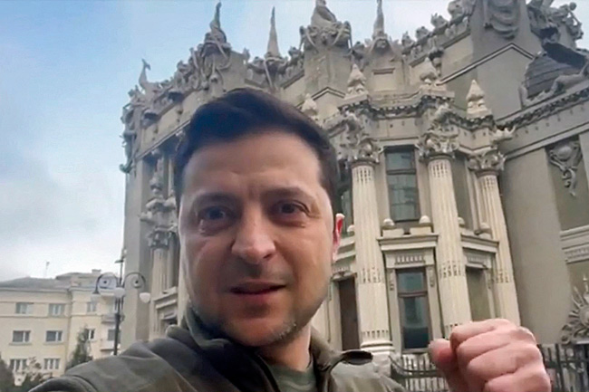
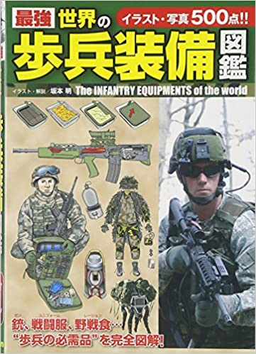
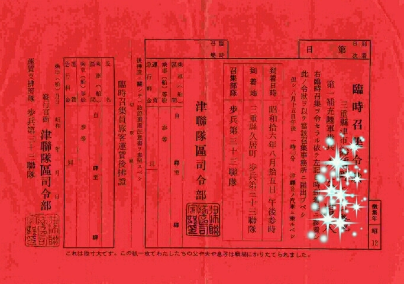
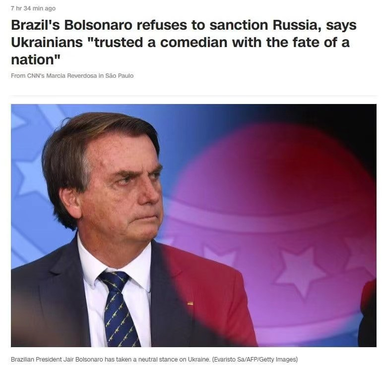

当ブログは「[ウクライナ危機](https://blog.loveapple.cn/tag/%e3%82%a6%e3%82%af%e3%83%a9%e3%82%a4%e3%83%8a%e5%8d%b1%e6%a9%9f)」のタグで、最新情報を更新してます。情報筋と別に、日本マスコミの点在されたニュースから、ゼレンスキーと欧米の窮地、および、日本マスコミの煽ってる印象操作の真実を暴きます。

今回のウクライナ戦争は、ウクライナとロシアではなく、NATOとロシアの戦争である。 あれ？と思う人は、先に「[【ウクライナ危機】どちらが悪いか？マスコミは教えない真実を暴く。そして中国の態度は？](https://blog.loveapple.cn/news/202202259006.html)」を前提として、目を通して頂きたい。

**Q：ウクライナ軍は勝ってるか❓**

A：結論から言うと、全敗です。どこまで進んでるかと正確にわからなくても、断言できるほどです。 **ポイント：** ・[ウクライナ制空権を確保](https://news.yahoo.co.jp/articles/ec6974158a9a75b17cde777911af74eb9856d140) ⇒露軍の制空権確保とは、空中から効率的な打撃、貨物、空挺部隊の輸送は、ウクライナが全てできなくなることで、まともな攻撃できなく、建物などに隠して、陸の戦闘しかできない。 また、現在戦争では、制空権の前提は制電磁権である。NATOからどこまで支援するか、分かりませんが、ウクライナ軍の部隊間の通信は、ほぼできない状況と言えるでしょう。 ・キエフの動画から ⇒キエフ等、現地から個人の上げた動画、ロシア戦地記者の動画から、露軍による一方的な攻撃のシーンは、基本、一致してる。こちらはウクライナ軍は真面な反撃できない証であり、ロシア軍は勝ってます。

**Q：ウクライナ人はゼレンスキーを支持して、露軍を戦ってるか❓**

A：一部の過激派を除き、ウクライナ人はゼレンスキー当局のために戦うつもりがないと断言できます。ゼレンスキーはウクライナをアフガンにするつもりだけである。 **ポイント：** ・民間人を強制に戦場へ送る。ウクライナ国籍の１８～６０歳の男性は出国できない。 刑務所から、受刑者を釈放して、戦場へ送る。 外国人傭兵の参入で、覚せい剤、強奪等の犯罪行為の横行

関連記事： [・検問所の兵士「女は行け、男は残れ」避難民が殺到…殺気立つポーランド国境](https://www.yomiuri.co.jp/world/20220302-OYT1T50042/) ・[ウクライナ大統領、EU加盟のスピード承認求める](https://www.bbc.com/japanese/60554549) ・[ウクライナに向かう「外人部隊」…ゼレンスキー大統領の呼び掛けに世界の参戦勇士が集まる](https://news.yahoo.co.jp/articles/e6eef294f9ec325ee6d10367b8a2e516bc9994a1) 現代戦争は求める軍人のスキルが高いので、ちゃんとした訓練を受けないと、戦場へ行ってしまうことが自殺行為になります。銃の使い方はもちろん、チームワーク、各設備の使い方等、沢山の専門知識は必要なわけ。 真面に訓練せず、民間人を送り込んでしまう時代は、日本では第二次世界大戦の末期である。 あの時代を経験したことなくても、一部の軍国主義の過激派を除き、当時の日本人は、死の覚悟して、日本軍国のために戦う人は多いですか❓と疑問してみてください。

**誰も戦いたくないからこそ、民間人を強制する一方、受刑者まで戦場へ送ろうとしてるわけです。**

当時の日本人も、今のウクライナ人と同様、逃げ道がなく、戦場へ送られてしまったわけです。 しかも、ウクライナ国内では、武器を持つ普通の民間人だけではなく、釈放された受刑者もたくさんいるわけです。プロの露軍、そして、チェチェン軍の相手にならない事、ウクライナの人たちは知ってるはずですから、武器を持って、行き成り戦場へ行くより、通行者、店舗などの強奪の方が楽なわけです。

更に外国人傭兵の参入は、覚せい剤、強奪の横行は、日本人の想像以上に、更に深刻になるわけです。 あの義勇軍に横暴した日本人男女たちは、戦場へ行ったらどうされるか、微妙です。

**Q：プーチン、ロシアは世界に孤立されてるか❓**

A：違います。逆に孤立されてるのは、米国かもしれません。 **ポイント：** ・制裁に参加する国は、[世界中ごく一部、国連193国の内、32国](https://news.yahoo.co.jp/articles/2a1eda2358c5afffcb8e92428642fcfb3f3ad10a)だけである。中国ほど、米国の暴威に対立ではなくても、各陣営を代表した国はロシア制裁に参加しないと明言する一方、NATO内部からも分断が起こってる。

関連記事： [米国、ロシアへの制裁の参加パートナー３２カ国発表…韓国は外された](https://news.yahoo.co.jp/articles/2a1eda2358c5afffcb8e92428642fcfb3f3ad10a) [スペイン、ウクライナ情勢受けエネルギー価格高騰の長期化を強く懸念](https://www.jetro.go.jp/biznews/2022/02/dc68d474112e26dd.html) [ロシア非難決議棄権の中国とインド　米大統領が名指しでけん制](https://news.yahoo.co.jp/articles/2a1eda2358c5afffcb8e92428642fcfb3f3ad10a) [パキスタン、ロシアへの経済制裁は「借金踏み倒し」→実は嘘情報　発信元も「フィクション作品です」](https://www.j-cast.com/2022/03/02432186.html?p=all) [巴基斯坦宣布将从俄进口约200万吨小麦 还买俄天然气(訳：パキスタン、ロシアから200万トン小麦と天然ガス輸入と公式発表)](https://mil.news.sina.com.cn/2022-03-02/doc-imcwiwss3748817.shtml) [ブラジル大統領、ロシア制裁を拒否　ウクライナ人は「コメディアンに命運託した」](https://news.yahoo.co.jp/articles/78a50e4251fb95cabc56202a6a7c55cb90f4119a)

こちらで各陣営とは、**** まず、中国、インドとシンガポールを除いた東南アジア諸国、東亜、南アジアと中央アジアの利益を代表した各国は、制裁だけではなく、中国とインドは、侵略さえも認めない。 イスラム利権を代表した中東は、行き成り米国との対抗が難しいが、パキスタンを表に立たせて、小麦と天然ガスの爆買いをします。 ラテンアメリカ諸国は、長年で米ドル覇権に虐められてきたので、対抗発言は特に目立つでしょう。

更に、注目していただきたいのはスペインです。NATO内部でも分断になっていること、米国による、欧州資産の収穫に反抗すべきだという声は上がっている。

**米国が孤立されることとは何か？**

これからの欧州は戻れないほど衰退して、弱まっていきます。 エネルギー高騰、アフリカ、中東、ウクライナから大量な難民はどんどん入ってくることによって、社会は深刻な混乱に陥るわけです。

中東、イスラムのシーア派、スンニ派は中国のおかけで紛争をやめ、同じ敵、ユダヤ(イスラエル、米国)に向かっていきます。 ラテンアメリカはいうほどでもありません。もともと、米国の覇権から脱出したいわけ。 残りは、英米＋日本、アングロサクソン系の海賊だけになります。

日本は忠実に米国のいうことをやるのか？違います。 [ウクライナ大使館「義勇兵」募集の事件](https://news.yahoo.co.jp/articles/36f1701c0dde05142c09d4930f537e6858e7551a)から、日本外務省はかなり怒ってるのではないかと分かります。

今回の制裁を通じて、ドルの決済システムSWIFTが危険であること、証明されました。ロシアだけではなく、米国に制裁されたことある国、言わなくても、代替手段を検討し、使うわけです。

ドル覇権揺らして、米国のいうことは、誰も聞かなくなるでしょう。 今後、米国に言われる事を聞かない自由が出てくるわけです。
