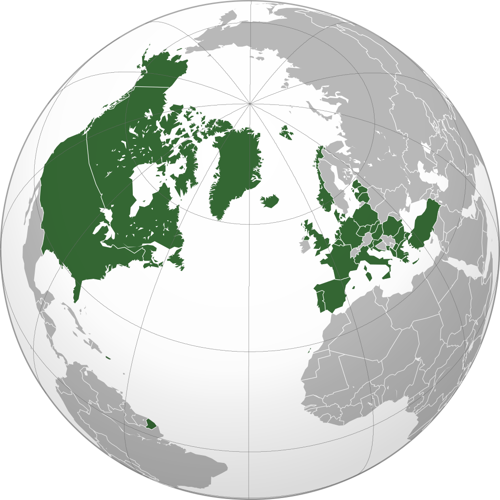
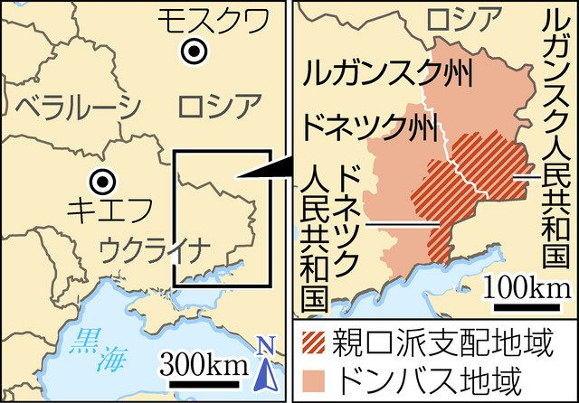
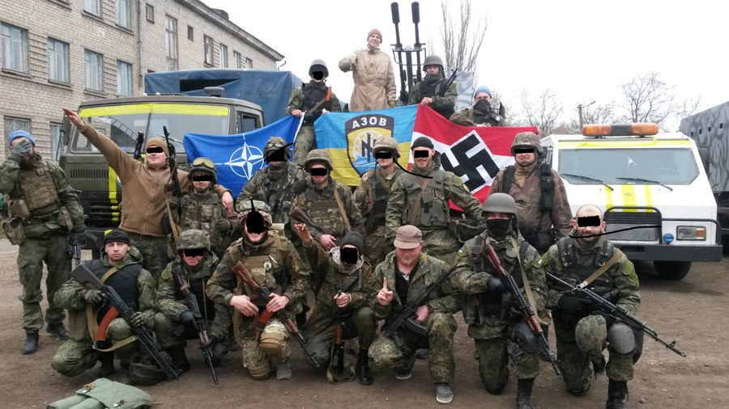
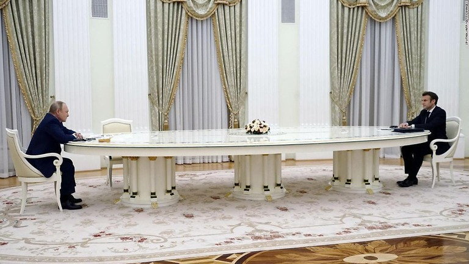
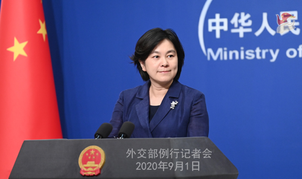

ロシアとウクライナの戦争はどちらが悪いか？マスコミはロシアがーだけど、事実はなにか？日本マスコミは教えない真実を暴きます。

大雑把な流れはこちらになります。 勿論、バイデンの挑発は欠かせないが、ゼレンスキーは真の犯人でしょう。

> NATO拡大⇒ロシアへプレッシャー⇒ウクライナのロシア市民虐殺⇒ウクライナのロシア侵攻⇒ロシア反撃

**前提知識：**

[米ソ冷戦](https://ja.wikipedia.org/wiki/%E5%86%B7%E6%88%A6)の時代、欧州はソ連を対抗するために、[NATO](https://ja.wikipedia.org/wiki/%E5%8C%97%E5%A4%A7%E8%A5%BF%E6%B4%8B%E6%9D%A1%E7%B4%84%E6%A9%9F%E6%A7%8B)という軍事連盟を立ち上げました。ソ連崩壊して、いまだに存在している。NATOの加盟国は、攻撃されたら、他国は共に戦わないといけない同盟ですので、加入の前提条件として、他国と国境の紛争があってはいけない。

そして、一目で防衛の同盟に見えるが、実には、米軍はNATOを利用して、欧州各国にミサイル等、攻撃用武器を配備して、実質上、NATO⇔ロシアの間、緩和地帯が不可欠である。

1990年、ドイツの統一の時から、NATOを拡大しない約束があったようだが、結局、今まで、NATOは5回の拡大して、今は、ウクライナもNATOへ加入しようとしてる。

30年以上前から、ソ連は消えたのに、NATOという軍事連盟は拡大し続けています。ウクライナまで拡大することは、ロシアと欧州間の戦略緩衝地帯がなくなり、ロシア側が非常に危機感を持っている。

**ウクライナからの挑発と戦争**

ウクライナには、ドネツク州とルガンスク州の独立問題があるので、NATOへ加盟するには、この東部の独立問題を解決しなくてはならない。こちらが、[ウクライナはNATO加盟の必須条件として、満たさなくてはならないと、バイデンは明言しました](https://jp.reuters.com/article/ukraine-president-usa-idJPKCN2DQ1AR)。

北京五輪の始まる前ごろ、[ウクライナは軍を東部に派遣して、民間人の虐殺、ロシア領内の軍事拠点の砲撃](https://news.yahoo.co.jp/articles/0df40cd1507b90e25832f026569938d3ced262a7)まではやり始めた。 因みに、ウクライナ軍と言ったら普通の軍隊？のイメージかもしれないが、実には、アゾブ連隊という団体があって、ロシア人、又は、親ロシアの人を簡単に虐殺する、ナチズムのテロです。 今回はまだ、公開された内容が少ないので、言えませんが、嘗ての戦場の中でも、ウクライナ軍は、ナチズムの旗を揚げた映像もありました。

ウクライナ人とロシア人の差は、日本の関東と関西の差と近いです。アゾブ連隊の人は普通のウクライナ人ではないこと、認識してほしいです。

ロシア大使は以下の内容を事前に明言しましたが、上記のテロ組織のおかげで、ロシア系市民の殺害はさけられないでしょう。

> 「挑発されない限り、ウクライナには侵攻しない。もしウクライナ人がロシアに対する攻撃を開始すれば、われわれが反撃しても誰も驚かないだろう。もし、ドンバスだろうと、どこであろうと、あからさまにロシア人の殺害を開始すればの話だ」([ロシア、ウクライナ東部で市民殺害なら対応へ＝通信社](https://jp.reuters.com/article/ukraine-crisis-russia-envoy-idJPKBN2KK0K7?feedType=RSS&feedName=special20))

結局、ロシアはウクライナ東部のドネツクとルガンスクを独立国家と認め、国連の平和維持部隊の名目で、ウクライナを侵入しました。

**欧州もロシアも、戦争を避けるために尽くした**

欧州はロシアの輸出市場である。ウクライナで戦争が起こったら、欧州にも、ロシアにも、いいことではありません。戦争が始まる直前、欧州の経済のTOPドイツ、政治と軍事のTOPフランスは、ウクライナ危機をめぐって、緩和するために、ロシアと会談して、ロシアも一時的に、国境から軍を撤退した。 ([プーチン氏、当面欧米との交渉続ける考え示す　ドイツ首相と会談](https://www.asahi.com/articles/ASQ2J24B2Q2JUHBI001.html)) ([プーチン氏、ウクライナの軍事行動巡り説明　仏大統領と電話会談](https://jp.reuters.com/article/ukraine-crisis-putin-macron-idJPKBN2KT3AI))

残念ですが、ロシアと独仏の力不足のようで、ゼレンスキーはどうしてもバイデンの望む方向で、ウクライナ紛争を興そうとして、今まで至りました。 何で？と疑問を持つ人は多いでしょうが、

1. 米国の金融危機を防ぐために、欧州にある資産を米国へ回したい。 欧州で戦争が起これば、欧州での投資は自然に米国へ流れて、バイデンは米国内の窮境を一時的に緩和できる。
2. ゼレンスキーは東スラブ人ではなく、ユダヤ人である。 普通のウクライナ、ロシア系の人と異なって、ウクライナに対した愛情がない一方、[イーホル・コロモイスキー](https://twitter.com/diplo_geo/status/1496897478519496715)の傀儡である。 東スラブ人の殺し合い、ロシアの崩壊は真の目的である。

**中国の態度**

中国は国連の秩序を守るのが一貫とした態度である。

ウクライナは独立国家であるので、ウクライナ⇔ドネツク、ルガンスクの関係は、中国⇔台湾の関係に近い。

ロシアと同盟関係とはいえ、台湾での主張と矛盾するので、表には支持と言えません。 関係各国、紛争をやめるようと、呼びかけてる。勿論、ロシアだけではなく、[欧米各国も、制裁で状況を悪化させるのではなく、本当の平和に向けてほしいこと](https://news.yahoo.co.jp/articles/fcebef4730f270a3eca2ee68a9b2dd258b3387c7)と言ってる。

ロシアの侵略は賛成できないが、欧米日は、ユダヤ資本の支配下、中ロ等、民族国家を圧迫している現状は確かである。ロシアは崩壊したら、中国は更に大変になると、北京五輪直前、プーチンと習近平の会談では、明言したはずではないかと推測します。

平和を呼びかける一方、中国はロシアを支援しているわけです。 以下、[宋文洲氏のまとめた内容](https://twitter.com/loveapple/status/1497006155130105857)ををもとに、④⑤を加えました。 ①中国は「国連憲章」堅持し国連加盟国の主権を侵害してはいけないと繰り返し強調 ②「東方不拡大」の約束をやぶった米国NATOの拡大と、彼ら過去の主権国への侵略にも反省を促す ③事態の拡大を止め外交会話による解決を目指す ④[ロシア全域からの小麦輸入を拡大へ](https://news.yahoo.co.jp/articles/edf9a69c6b5e6627246e1eb47b12af532a548824) ⑤[中ロ、ガス供給拡大で関係強化](https://www.jiji.com/jc/article?k=2022020401112&g=int)

**まとめ**

ぶっちゃけ言うと、ウクライナ戦争を興したのは、バイデンとゼレンスキーです。 1990年代以降、平和だったのに、ウクライナはNATOを加盟しなければ、今の戦争がありません。

**補足：**

日本マスコミの報道を待ってたので、時間がかかりました。 [王儀外相は正式に中国の立場を表明した](https://www.afpbb.com/articles/-/3392209)。

[宋文洲氏は分かりやすくまとめた中国立場](https://twitter.com/sohbunshu/status/1498206721038512133)の内容を引用します。

> ①中国は、各国の主権と領土保全を尊重しウクライナでも同様 ②中国は、NATO拡大下のロシアの安全保障面の正当な訴えを支持 ③中国は、ウクライナ危機の制御不能を避け、平和解決に努力

日欧米中、明らかに、本気で戦争を止めようとしてるのが中国だけです。 理屈は簡単です、隣人は喧嘩した時、第三、第四者は止めようとして、当事者の二人に、包丁、棒等の武器を渡すのと、調停に入ろうとするのとの差です。なぜか、多くの日本人はこんなシンプルな筋道を理解できないようだ。
