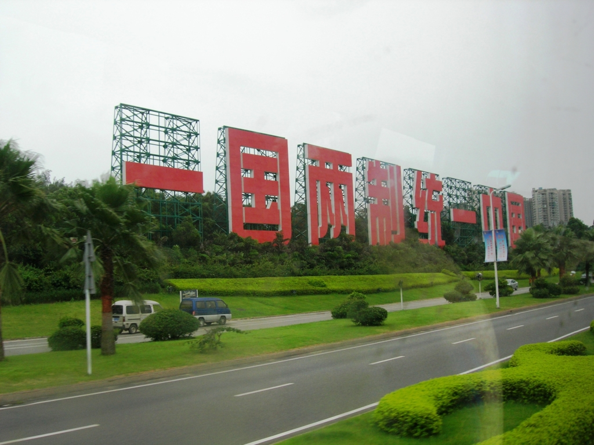

中国の武力より台湾統一する場合、東亜のアフガンになるかと恐れる人はいるでしょうが、それは勘違いです。  
アフガンにならない台湾の特徴：  
1．ムスリムと異なって命を懸けて、独立を擁立する人が極めて少ない  
　　強硬な種族は既に日本軍に大量に虐殺された訳だ  
2．アフガンのように色んな所と繋がる内陸ではなく、孤立される島だ。  
　　言い換えると、ゾンビだらけでも、他の地域への影響は極めて少ない

但し、台湾有事になったとき、日本への影響は致命的だ。日本方向への南シナ海の通路は戦場になって、物価は高騰になるわけだ。かわりにアメリカとロシアから石油を輸入する？

在日米軍は、戦場の目の前に置いてしまうため、沖縄から撤退しなくてはならない。アジアでの勢力は圧縮されることになる。

香港の続いている騒動からもわかるでしょうが、台湾と大陸の間、海があるから、簡単に影響しないでしょう。

武力の統一はあくまで中国の手段で、目的ではない。日本にとって、台湾島の平和が非常に重要な訳だ。賢明な方法としては、台湾独立の勢力を圧縮させ、バランスを維持するのに貢献した方がよいかと思います。

勿論、台湾の未来は、台湾でも日本でも決められるものではなく、中米の利益交換結果の次第だ。もし、今の中国は台湾を統一と確定したら、一瞬なことだ。
