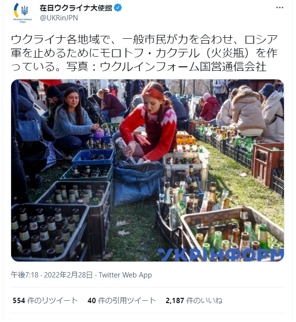
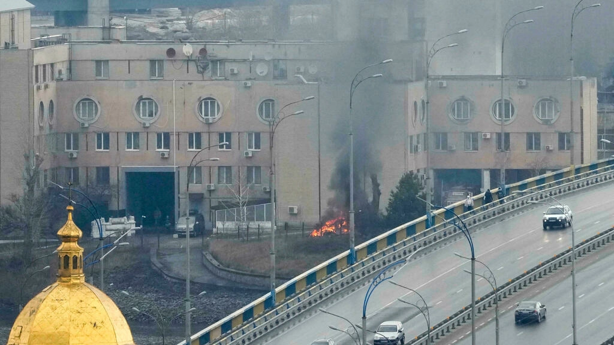
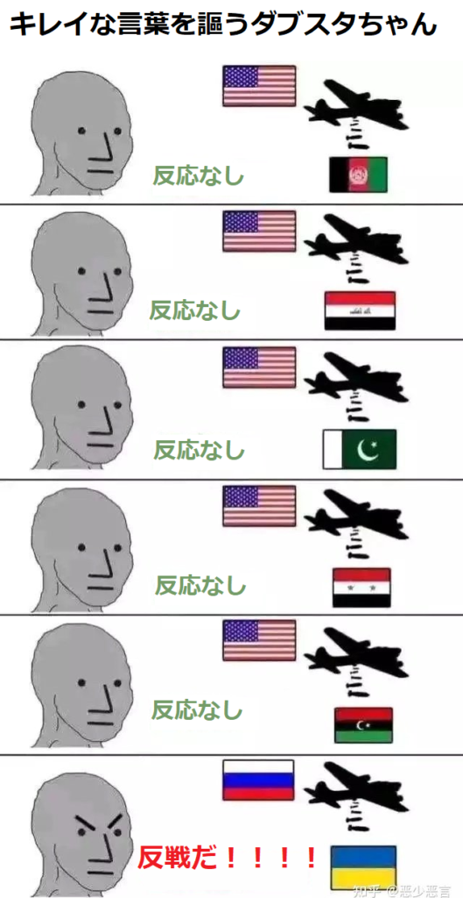

日本はウクライナ紛争の実情報の入手が困難な状態です。こちらの収集した情報と簡単な推測を共有します。

**情報筋からの展開**

1. ハリコフの作戦はほぼ完了し、キエフ中心部以外、占領済み。  
    ドニエプル川沿い、西東を分ける状態はほぼ確定し、第一段階の作戦は収束状態である。
2. 民間人撤退状況次第、近日中に、キエフの決戦開始。
3. 第二段階作戦：ウクライナ全域占領
4. ポーランド、ルーマニア、スロバキアの侵略も視野内。  
    バルト三国は圏外。

**欧米の目的**

欧米の目的は、ウクライナをアフガンにして、ソ連崩壊の歴史をロシアで再現することです。  
但し、ウクライナはアフガンになりません。欧州全体は紛争状態に陥ること。  
まず、まとめた情報：

- ゼレンスキー当局は、民間人へ武器提供  
    日本語記事少ないので、中国語の記事のリンクを貼り付けます。「[乌克兰对守土民众配发武器](https://www.rfi.fr/cn/%E6%AC%A7%E6%B4%B2/20220224-%E4%B9%8C%E5%85%8B%E5%85%B0%E5%AF%B9%E5%AE%88%E5%9C%9F%E6%B0%91%E4%BC%97%E9%85%8D%E5%8F%91%E6%AD%A6%E5%99%A8)」
- 欧米から、ウクライナへRPG、銃など、軽武器を積極的に提供。戦争を終わらせる大型武器×、市街戦等、とにかく、戦争を長く続けてほしいこと。  
    記事例：「[ドイツ、ウクライナに武器供与を発表…](https://www.yomiuri.co.jp/world/20220227-OYT1T50055/)」
- ウクライナ市民を肉の盾にするゼレンスキー当局、[公式のウクライナ大使館は、市民に火炎瓶を作る事を報道](https://twitter.com/UKRinJPN/status/1498241285895122944?s=20&t=x3gDALUQzv1mGX1c6hJRUA)してます。  
    ヒトラー、日本軍と一緒、民間人を戦争に巻き込む、低劣なナチズム行為である。
- ゼレンスキーは犯人を釈放して戦場に投入すること。「[乌克兰释放大量参过军的囚犯参战(中国語)](https://baijiahao.baidu.com/s?id=1725922439011705523&wfr=spider&for=pc)」
- 外国人の志願軍編成「[ウクライナ、外国人部隊編成へ　国外から志願募集](https://jp.reuters.com/article/ukraine-crisis-foreign-legion-idJPKBN2KW07K)」

ゼレンスキー当局、欧米各国はウクライナの平和ではなく、戦前の挑発から、更に混乱な状態にさせることは明らかです。  
前述通り、ウクライナの紛争に欠かせない軽武器は、欧米各国から何かしらの形で提供しています。更に、ゼレンスキーは民間人へ武器提供と、強盗、強姦等の犯人を刑務所から出して、武器を渡して自由を与えたことで、本当にロシア軍と戦ってもらうか？もちろん違います。

まず、犯罪者まで軍に投入することは、ウクライナイ人はゼレンスキー当局のために戦う人が限られる証拠である。玉砕です。もともと強盗、強姦等の犯罪者だから、自由を得て、一番先にやろうとすることは、ゼレンスキーを守るより、金を奪って、可愛い女とやることでしょう。  
ロシア軍より、チェチェン軍の怖さは普通に知ってるはずですから、普通の民間人も、行き成り戦場へ行くより、生活困窮に陥った人たちは、スロバキア等隣国で銀行等を強奪して、ウクライナへ逃げて隠した方がましでしょう。

更に、外国籍の軍人までやってくることは、ウクライナは犯罪者の天国になることは間違いありません。在日米軍、覚醒剤の持ち込み事件からも、一班を見えるかもが、覚せい剤、殺人横行な煉獄になる。

欧米、ゼレンスキー当局はウクライナをなるべく紛争な状態にさせてるが、アフガンにならない根本的なことは、中央アジアのような山地ではなく、平原だからです。

アフガンの山地では、ヘリ、戦車など、最先端な重量武器を使えなく、軽量武器になるのと、大規模な軍事力より、少人数の遊撃部隊は活躍するところになります。こちらは、イギリス、ソ連、アメリカはアフガンで失脚した要因である。ウクライナではこのような環境ではありません。

そして、露軍の今の動きから見ると、これらの**犯罪者、ネオナチ、外国軍隊に向け**ては、核汚染ない、戦術核兵器を使う可能性が高い。既に[真空爆弾を使ってるよう](https://jp.reuters.com/article/russia-vacuum-bomb-ukraine-idJPKBN2KX2V6)です。

**まとめ**

ウクライナ紛争の当初、戦争まで行かないだろうと推測したが、ゼレンスキーと米国の挑発のおかげで、北京五輪が終わったすぐ、ロシアも参戦して、更に、ゼレンスキーと欧米の挑発はとどまらないので、ウクライナ全域だけでは、とどまらないかもしれません。

戦火はポーランド、ルーマニア、スロバキアまで及ぼし、西ヨーロッパまで、脅かします。少なくとも、ウクライナ西側の周辺は、不安定になり、紛争状態はしばらく続くでしょう。  
意図的に民間人を巻き込むゼレンスキーはまるで戦犯です。

日本語のマスコミだけでは、依然として、ウクライナからの本当の情報の入手は困難であることが変わりません。しばらく間、日本右翼とダブスタちゃんは、ウクライナ紛争で、盛り上がりります。

