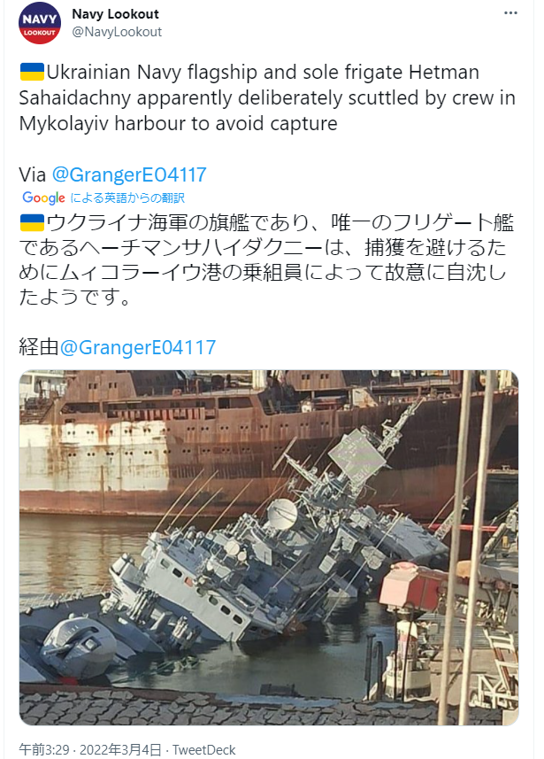

日本はウクライナ紛争の実情報の入手が困難な状態です。こちらの収集した情報と簡単な推測を共有します。

**情報筋からの展開**

1. ハリコフ完全制覇。１、２建物が残ってるだけの状態だった。
2. [3/1速報](https://blog.loveapple.cn/news/202203019060.html)に伝えた第一段階の作戦は完了
3. ロシア側損失公開
    1. 露軍： 死亡：498人 負傷：1597人
    2. ウクライナ軍： 死亡：2870人超え 負傷：約3700人 捕虜：572人
4. ウクライナ軍は、各都市で、大勢な滞在外国人を人質にしてる。 いち早く、外国人を戦場からの救出を、各国の領事、ロシア政府にお願いしたい。
5. ウクライナ全域の都市を包囲状態である。 市街戦で、まちへの崩壊を最小限に抑えつつ、進んでいる。 これから外国人傭兵はどうやって、都市へ浸透するか、平原で重武器で殲滅されるかと推測。
6. ザポロジエ原発火災の報道はフェイクニュース(儀情報)である。(ウクライナ発？) ⇒放射基準値は特に大きな変動がないらしい
7. FRB利上げ。欧州資産の収穫は頓挫してるため、台湾海峡で新たな紛争を興す可能性が高い ⇒戦争直前、フランスは多くの銀行はCIPS導入ずみ。中ロの天然ガス決済はユーロ使用。

※ウクライナは国家行為⇒国家テロになっている。

補足： 印象操作のデマが多いので、露軍は既にウクライナ全域の制空権を握ってると証明するニュースのまとめておきます。

- [「約64キロにわたる車列…ロシア軍、ウクライナの首都キエフに迫る　“燃料気化爆弾”報道も」](https://news.yahoo.co.jp/articles/d2dc5e528490f827ec155191d5eb30f9a860190c) ⇒長い行列の戦車とは、制空権は完全に問題ないことの証である。でないと、全滅されるわけ
- [「ウクライナ海軍の旗艦であり、唯一のフリゲート艦、ヘーチマンサハイダクニーは、捕獲を避けるためにムィコラーイウ港の乗組員によって故意に自沈した」](https://twitter.com/NavyLookout/status/1499451969144037384) ⇒制海権の前提は制空権である。 制空権があれば、NATO系の隣国へ逃げる方法があるはずだが、逃げ道ないことは、制空権完全に失った証である。
