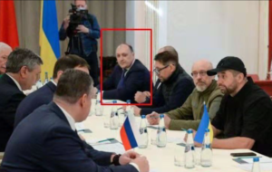

日本はウクライナ紛争の実情報の入手が困難な状態です。こちらの収集した情報と簡単な推測を共有します。

1. 露軍は相変わらず、予定通りに進行中。 軍の主力は交通中枢の都市のコントロールを中心に進行し、市街戦は内軍中心の作戦は明らかに。 ハイテック装備はほとんど動いてない中、60万平方キロメートル領域、数万人で早い進行は、露軍の強い戦力の証である。
2. ロシアと1回目の交渉担当のメンバ、デニス・キリエフは、ウクライナ保安庁(SBU)により銃刑。 同氏は、本気で戦争を停止させたいか、ロシアのスパイか、明らかになってない。
3. ゼレンスキーはキエフから脱出して、ワルシャワ(ポーランド)の米大使館に隠してる可能性が高い。 米国はオーランドでゼレンスキー亡命の樹立を検討中の噂がある。
4. ゼレンスキーは交渉を利用して、更に、ロシアを挑発することは明らかである。
5. プーチンはウクライナの分断、傀儡政権の樹立、親ロシア政権の樹立のパターンを考えてない。 軍事はウクライナをコントロールし、政権は今のままの可能性が高い。 ゼレンスキーはポーランドで亡命政権を立ちなければ、ウクライナ大統領のままの選択肢もある。
6. SWIFT等、金融関連のロシア制裁したため、[ウォール街は数万億ドル以上の損失を見込み](https://twitter.com/loveapple/status/1499664894102499328?s=20&t=2-2E-Kl3E8QiHINit2Mmbw)。 例えば、VISA、MASTERのサービス停止とは、契約違反のため、ロシアで両キャリアのカードローンで悩んでる人は、これから、返済不要になります。

