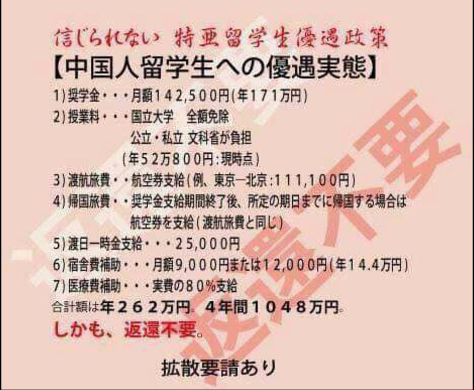

<figure>

<figcaption>

どこまで真実か調査しないが、取りあえず真実だとします。

</figcaption>

</figure>

何故か、増税しても日本の国費で千万を出すかと、数千万、億以上の価値を見込めるからだ。大雑把いうと、一般の日本国民の10人、100人に金を出すより、日本にとって価値のあるからだ。

中国人留学生は日本で沢山いるが、この国費を得られる人はエリートに限られている。プライベートに関わるので、煩く聞けないが、 私の知り合いの中では、恐らく全額？得る人もいます。旅費まで国から出すか聞いたことがないが、すべての学費、一部の生活費(10-20万程度)は奨学金としてもらって、普通のアルバイトより儲かったようだ。  
博士を修了後、ある大手企業の研究部署で、 ウィルスを研究する仕事だそうで、数年間勤めていた。日本の給料は安くて、結局アメリカ？へ転職したようだ。  
同氏は、簡単な挨拶以外、日本語全くできない、新卒?の年収は1000万台だそうです。

凡人の私も、国費の奨学金、合計数十万円を半年間でもらい続けた経験がある。勿論、奨学金をもらえる条件があるのだ。言い換えると、私はアルバイトで生活費を儲けながら、同学年の中で、普通よりよい成績を取得した時期があることだ。

権力ばっかり主張して、あまり勉強の経験が少ないような人に通じないかも知れないが、  
どの国でも、国費で外国人留学生を奨励する制度があるわけだ。勿論、国によってやり方は異なるが、日本は中国人留学生にこれほど奨学金を出すことは、代わりに、中国も日本人の優秀な学生に奨学金を出す訳だ。

優秀な留学生は、どの国でも優秀な資源であり、将来は政界、商業のリーダ、経営者になるはずの人たちだ。中国のリーダ、経営者の中で、日本留学経験の人が多いことは、社会的に親日が主流になりやすいことと、日本の考え方、日本の産業基準は中国で通じやすいことだ。逆も同じ。日本にとって、千万円単位で測れない長い利益があるわけだ。勿論、逆も同じ。

日本の公務員は中国人の利益を考えません。中国人に有利な政策があるとしたら、裏側に必ず国益のために、何かしらの理由があるわけだ。  
この拡散のおかげで、中国人留学生への奨励が縮める、又は、なくなるとしても、中国は日本人留学生への奨励をなくすなど、恨みを返すことがまずないと、取りあえず言っておき、短視の日本人に安心させよう。  
単に、中国人の優秀な人材を留めて、他国へ分流させるだけだから、日本人の「自虐」だと私は言います。逆に、中国は世界中の優秀な人材をあらゆる手段で吸収するでしょう。

どうしても自虐したい人はいるでしょうから、仕方ないが、自閉して、2流国家から、3流にする日本を見たくなくて、ここまで長文にしました。
