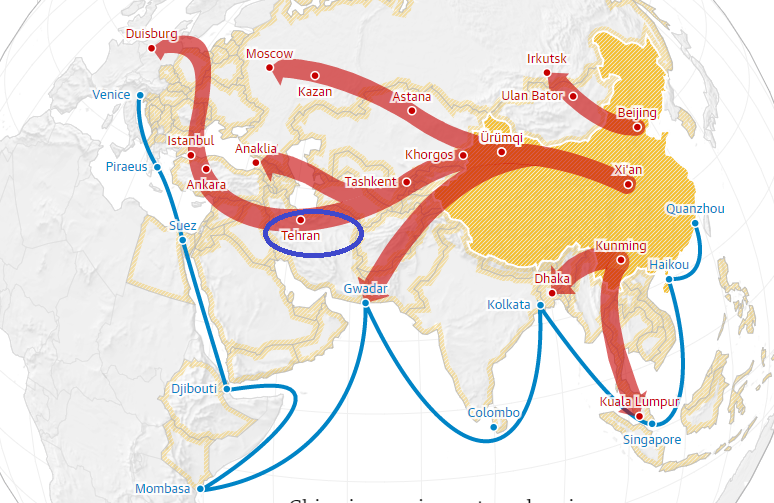
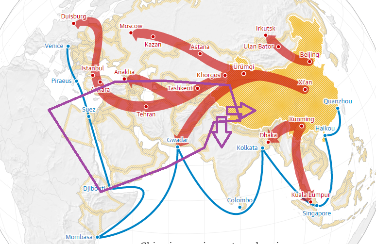

最近のイラン情勢について、ペルシャ湾で戦争起こるでしょうが、第三次世界大戦に至らない。アメリカはシーア派(イラン等)とスンニ派(サウジアラビア等)の対立を挑発して、地域の混乱させるには力を尽くすでしょう。但し、アメリカは直接戦争への参加は自制します。  
イランの問題は、イランに限るものではなく、欧亜大陸、アメリカの経済、そして、国家戦略に関わるものである。歴史から、イラン問題について説明したいと思います。

<figure>

<figcaption>

イランの一帯一路上の位置

</figcaption>

</figure>

**世界工場の遷移  
**欧亜大陸は元々人類文明の中心である。世界工場とは中国からのものである。陶磁器、シルク、茶、調味料などの販売から、千年以上、ヨーロッパの市場を占め、世界のマーケットと世界工場の関係は成り立った。産業革命のおかげで、イギリス、ヨーロッパは世界工場になり、東アジアは重要なマーケットに変わって、その欧亜大陸をつなげるのが、曽てのシルクロード、今の一帯一路の路線が非常に重要であることは見えるでしょう。

1895年頃、アメリカ大陸から、アメリカはイギリスを追い出し、マーケットを制覇した。新たなマーケットを開拓するために、欧亜大陸への進出をしなければならない。第一次世界大戦と第二次世界大戦は、アメリカの飛躍の要因で、欧亜大陸の紛争こそ、アメリカの軍需産業は急成長になるわけだ。日本の大東亜共栄圏の暴走も、裏側にアメリカの陰謀があったのだ。  
第二次世界大戦の終わりごろ、ヨーロッパ全体は廃墟になりました。曽てのナンバー２のイギリスは、著しく弱体化になり、東亜の日本も崩壊された。さらに欧亜で駐軍することで、欧亜大陸、完全にアメリカにコントロールされることは実現できた。

戦後のヨーロッパの経済が崩壊されたので、新たにマーケットの開発はせざるを得ない。それは、マーシャル・プランだ。アメリカ版の一帯一路とも言えるでしょう。アメリカはヨーロッパの戦争の借金の返却に対して、遅延してもらい、更に、インフラ建設などに新しい借金を低金利で貸す。これでアメリカという世界工場は成り立って、アメリカのお金でアメリカの製品を買ってもらって、戦後のアメリカの工場を動かした。利益は十分確保できた場合、金利をなしにしてあげるなどの優遇政策もありました。  
世界工場のアメリカをマシンを例えましたら、この時期の中東は重要な燃料タンクであり、中東の石油の一番大きな顧客はアメリカだった。

時が経って、世界工場は、アメリカ→日本へ移って、そして、中国へ移りつつある。今の中国は世界工場になっている中、 マーシャル・プランと同じような一帯一路戦略を始めた。 しかも、中東の石油の一番大きな顧客はアメリカ→中国に切り替わった。代わりに、アメリカは大きな石油の輸出国になりました。  
この状況は、ヨーロッパと東亜は、新たな世界工場へ成長して、アメリカの発展は頂点になり、衰退しつつあることを証するでしょう。

**欧亜大陸の断片化はアメリカの戦略だ**

アメリカはにとって、一番恐れているのが、人類文明の中心である、欧亜大陸にマージナライズされることだ。逆に、欧亜大陸にアメリカを離れないほど必要とする方法は内乱を起こさせることだ。2回の世界大戦があったが、核武器登場することにより、地球を滅ぼすほどの戦力を持つ事で、再度に使えません。これも、戦後、小中規模の戦争沢山あったが、核を持つ国家間、直接にホット戦争が起こらない要因である。

欧亜大陸の紛争をさせるために、アメリカはイデオロギーを武器にして大成功を齎しています。  
冷戦でソ連とヨーロッパを対立させて、ソ連崩壊しても、ヨーロッパはその対立を継続させています。これだけでは、物足りない。

<figure>

<figcaption>

紫色で囲んだのが大雑把なムスリム勢力で、ヨーロッパではコントロールできる範囲、東側ではチベットで、中国政権は留め、南への拡散は、インドより留めている。

</figcaption>

</figure>

アメリカは欧亜大陸を繋げる中東をムスリム勢力で、紛争状態を作っている。色々カラー革命を輸出して、イエモン、シリア、イラク、リビア、エジプト等々、断片化させることで、アメリカは火をつけて、コントロールできることを実現している。これは、民主、自由というイデオロギーの本質でもある。  
アメリカは作った戦災で、沢山の難民発生して、既にヨーロッパへの影響は数十年間継続している。ロシア向けにチェンチェンのテロ育った。但し、アメリカの意図は分かっているので、ヨーロッパも、プーチンリード下のロシアも、鉄板のように一丸にしている。  
現在は、中国の新疆、インドに対して、ムスリム勢力で進行させているが、中印も全力で、テロを留めている。

中印露、そしてヨーロッパは、経済発展するために安定な環境を築き、「統一」を主軸して、原木のようなもので、アメリカは簡単に火をつける事ができない。前述のように、火をつけるために、イデオロギーで断片化させ、枝から火をつけなくてはならない、去年から香港の騒動はその火遊びの成果だが、深センの川まで留められたのだ。  
更に火をつけるために、中東、既に断片化に成功した所から火をつけ、油をかける方が効率的だろう。しかも、アメリカは石油の輸入国から輸出国に切り替わったので、中東という燃料タンクが必要としないので、爆発させたら、ヨーロッパと東亜、この二つのマシン(世界工場、マーケット)が困るだけだ。

**イラン周辺の動き**

中印露欧は統一を重視してるので、断片化できるのが中東だけだ。 アメリカは世界TOPに立つ、今後の数十年、又は、百年の間、中東が紛争の終わらない地域でしょう。但し、今のアメリカは直接イランを侵攻しないでしょう。もし、侵攻の計画があるならば、ドローンが撃落されたきっかけで、十分な理由であり、今まで待つ必要がない。台湾、朝鮮半島の問題もあるので、シーア派(イラン等)とスンニ派(サウジアラビア等)の対立を挑発して、代理人で戦ってもらう方が賢明でしょう。

ペルシャ湾から輸出する石油は、主に日中韓、特に中国が一番多い。日本には致命的な存在である。それは中国海軍、日本自衛隊は軍艦を派遣する理由であり、エネルギーの貿易通路を守るためだ。  
ロシアは中東から石油を輸入しないが、一帯一路の欧亜大陸の通路を制覇するために、中東で存在しなくてはならない。但し、ロシアにとっては平和だけを望むのではなく、ある程度の乱を望んでいる。しないと、ロシアの出番がないからだ。逆に、アメリカの火が足りなかったら、ロシアは敢えて火をつけ、紛争を興すかもしれない。且つ、どこまで何をやるか、米露間では事前の合意があってもおかしくない。ロシアの戦略の詳細について、今回の対象外ですので、割愛させてください。別の機会で紹介したいと思います。

イラン問題のエスカレートは、アメリカ一方だけに有利だが、日韓の反発も招いてしまうので、世界大戦まで至らないでしょう。但し、イスラエルを使って、 シーア派(イラン等)とスンニ派(サウジアラビア等)の対立を挑発して自ら火を燃やさせることは可能だ。  
但し、アメリカは完全に撤退もできない、ロシアの勢力は浸透してしまい、中東の利益が奪われるでしょう。

イランはアメリカの中東を紛争させる戦略は分かるでしょうから、反米の歩む道しかないと分かって、中露と軍事演習までやったと思う。  
但し、中国は簡単に中東の紛争へ参入しないでしょう。エネルギー供給基地として、ビジネスの遣り取りはメインでしょう。この点について、日本の方針は中国と同じ方向だと思います。

**まとめ**

中露欧印は、アメリカのイデオロギーの本質を看破しているから、統一を主軸して経済発展をメインとしている。一帯一路の中東路線に、アメリカは火をつけて、紛争させているが、海上通路、北側の通路、そして、ロシアの北極通路は今後も開通されるので、欧亜大陸発展は留めないでしょう。  
今の時代は、欧亜大陸にとって、非常によい、崛起の時代であるのだ。代わりに、アメリカは衰退していくでしょう。そして、アメリカは欧亜大陸の発展を牽制するために、中東を少なくても数十年の暗い時代にさせている事が残念です。
