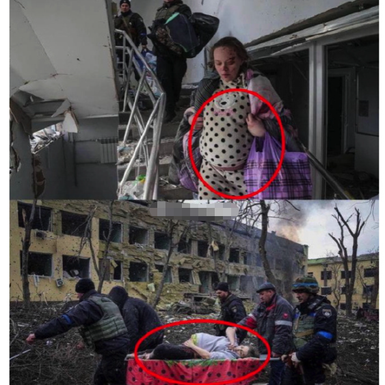
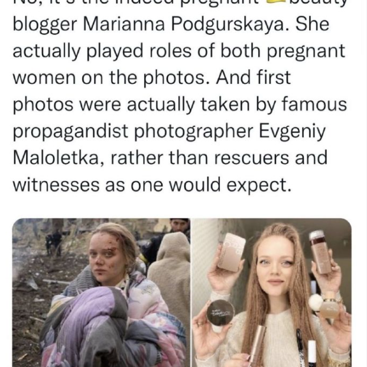

日本はウクライナ紛争の実情報の入手が困難な状態です。こちらの収集した情報と簡単な推測を共有します。

1. 3/10 ラブロフ露外相、トルコのアンタリアでウクライナのクレバ外相と交渉。 交渉は困難を極め、停戦合意には至らず。対話の継続では合意。
2. [ロシアがハイテク兵器、レーザー誘導式の砲弾投入を公表](https://southfront.org/russian-military-has-begun-to-target-ukrainian-forces-with-laser-guided-artillery-rounds-video/)。
3. [ロシア国防省 は、ウクライナ のキエフ、ハリコフ、オデッサの研究所が参加して実現し、](https://twitter.com/sputnik_jp/status/1502176572345708550) 2020年まで予定されていた米国の極秘プロジェクトUP-4の詳細が明らかになったと発表した。
4. [クロアチア の首都で正体不明の物体が落下　爆発](https://twitter.com/sputnik_jp/status/1502184715163471878?s=20&t=8pSBE9qd2WpsnNGaVBnjkg)
5. [日本マスコミでは、露軍が極悪と表現してるが、実には、実にはチェチェン部隊を含めて、厳格な規律を守ってる](https://twitter.com/DonbassSegodnya/status/1501867192530395137?s=20&t=8pSBE9qd2WpsnNGaVBnjkg)。
6. ウクライナのバイオ試験室を巡って、Youtube等、試験、研究所関連のキーワードが厳しく制限してるようだ。
7. ロシア銀行、人民元の貯金の利息8%ほど？
8. [プーチンはロスチャイルド家族を怒らせたようだ](https://jp.wsj.com/articles/what-russias-invasion-of-ukraine-means-for-investors-11645747247)。
9. ウクライナ大使館は日本内政干渉。不良に絡まれて、脅迫されてるような感じはしない？ 
10. 露軍の産科・小児病院攻撃はフェイクニュース。 中の1人の出演者は2人の産婦を演じたことで、異様が気づかれた。 本人は、現地のインフルエンサーであることを判明。 
