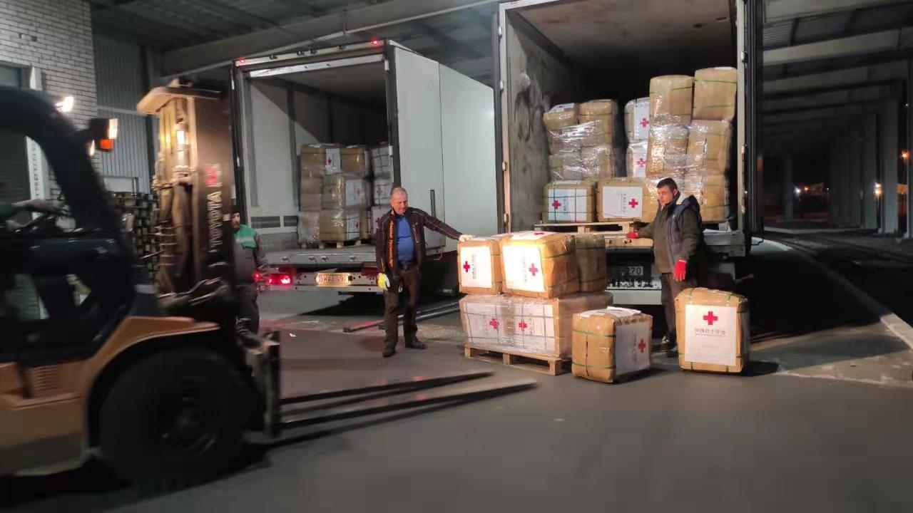
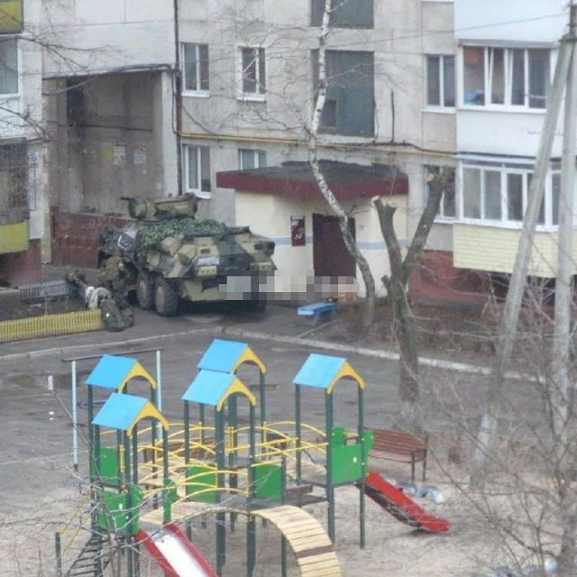
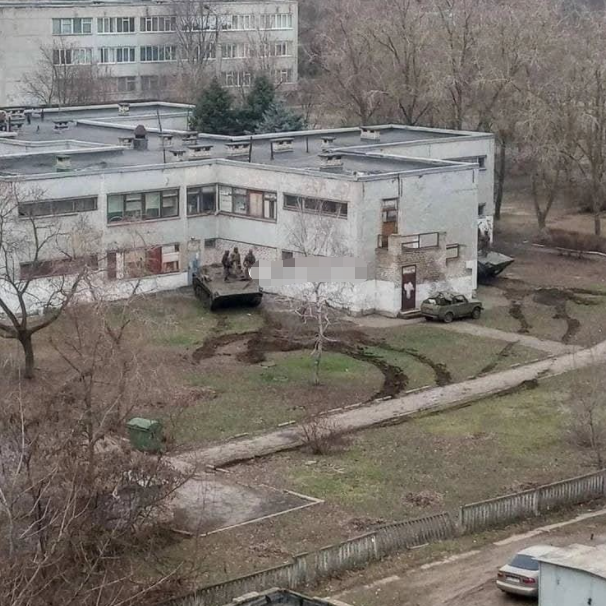

日本はウクライナ紛争の実情報の入手が困難な状態です。こちらの収集した情報と簡単な推測を共有します。

1. [3/13の夕方、中国からウクライナへ、第二回目の支援物物資は、ウクライナのチョップに到着](https://news.sina.com.cn/c/2022-03-14/doc-imcwipih8308318.shtml)  
    食品、寝袋、防湿シート等の人道支援の物質は、中国赤十字社⇒ウクライナ赤十字社に支援した。  
    
2. 3/12露軍の報道によると、3593か所の軍事拠点を破壊した。  
    3/10、3/11あたり、2千か所だったが、1日で千ほどの軍事拠点を破壊したことは、電子線機能装備したSU-57ステルス機を投入した結果だと思われる。
3. SU-57のウクライナ戦場投入で、ポーランドが救われた。  
    米国と誰がMig-29を支援するか、揉めなくてもよい言い訳ができました。
4. ウクライナ戦場、ロシア空軍の現状を簡単にまとめ
    1. ウクライナ軍は防空ミサイルなどの装備を、民間施設の中に配備してる
    2. 予算が限られた露軍には、AI化が遅れて、ドローン等の偵察が過不足
    3. 民間施設を避けながらの精密爆撃のために、戦闘機は超低空で飛行して、ターゲットを特定しなくてはならない
    4. 目視でも見える高度だから、NATO等支援したスティンガー携帯式防空ミサイルのターゲットになるので、SU-34、SU-27、SU-30まで、撃ち落された状況である。制空権があっても、中々、不利な現状である。
    5. 電子戦機能装備のSU-57を投入して、スティンガーが使えなくなるので、今後、空軍の状況の改善を期待できる
    6. 下の図はウクライナ軍は、戦車等を民間施設に止める一例である。  
        
5. ポーランドとウクライナの国境にあるNATO拠点を攻撃
6. ポーランド等、逃亡したウクライナ人女性難民は、男性の家族と離れたたため、  
    人口売買等の不正業者、性的搾取等の侵害に脅かされてる状況である。  
    ⇒日本は相変わらず、無力でありながら、救助の演出を行ってる。[今回は3人を救えたらしい](https://www3.nhk.or.jp/news/html/20220310/k10013524751000.html)。
7. プーチンは外国からの志願軍を歓迎すると発言。  
    イラン、リビア等(朝鮮もあるはず)、16000人ほどの志願軍は、ウクライナ東部へ、露軍の味方に加える。  
    ⇒こちらはウクライナ戦争は長期になる準備である。
8. NATOから大量な武器が支援された一方、全く管理されいない。  
    あらゆる人に武器を持ってる状況だから、重要な都市、拠点などをコントロールしても、  
    ウクライナ戦争は長期化になる環境として、備えてる。
9. NATOからの義勇軍(傭兵)の現状。一人のイギリス人は暴いた内容：  
    元情報：[https://www.thesun.co.uk/news/17899587/ukraine-war-russia-british-fighter/](https://www.thesun.co.uk/news/17899587/ukraine-war-russia-british-fighter/)
    
    1. イラク、アフガン戦場で経験した英軍の軍医である
    2. 制空権のないウクライナ戦場では、全く地獄のような場面では、イラクとアフガンの戦場と、全く違う
    3. ウクライナ人と一緒に死ぬまで戦うと誓ったが、全く戦えずに、身を隠したことで、ウクライナ軍に、ロシア軍からのスパイかと疑われたようだ。
    4. 今は、既に逃げて、帰国した。

https://twitter.com/sofimari21/status/1503180841039540227?s=20&t=DtiN0s4i0vCPJZO0FbSHLA
