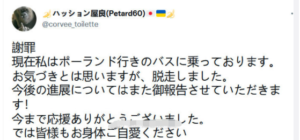

日本はウクライナ紛争の実情報の入手が困難な状態です。こちらの収集した情報と簡単な推測を共有します。

1. ロシア国防相：3/14午前、ウクライナ西部の軍事演習所を空爆し、外国人傭兵180人を殲滅した。  
    [https://jp.sputniknews.com/20220314/180-10357008.html](https://jp.sputniknews.com/20220314/180-10357008.html)
2. 今回の攻撃を受け、多くの傭兵はウクライナの現実を知り、逃げ出しました。  
    こちらはフランス籍の傭兵は、ウクライナで18時間滞在して、帰国したらしい。  
      
    あの日本から傭兵も、ポーランドへ逃げたらしい。  
    
3. あの自衛隊の経験者を含めて、NATO、米軍系の傭兵とは、NATO等、制空権ありきの戦闘で、あまり抵抗力のない戦場を清掃する経験である。  
    ウクライナ戦場では、逆に制空権がなく、支援もないから、いくらベテランと言っても、体系化した露軍に直面するのはほぼ自殺行為になります。  
    これらの傭兵には、未曾有の戦争体験になるでしょう。
4. NATOのE-3早期警戒機の前、ポーランド国境数キロ離れたNATO軍の拠点をミサイル攻撃しても、NATOは何の反応もないことから、ウクライナ全域、ロシア軍の完全制覇の推測は証明されている。
5. [ウクライナ軍、ネオナチの虐殺から逃げて、戦場から脱出してきたウクライナ市民は増えている](https://twitter.com/mietobeangel926/status/1503267669520584704?s=20&t=87Cy0irG2PNQTOiFH_qvBw)
6. 東部、落ち着いた地域から、ロシア軍からの物資支援は行っている

https://twitter.com/sofimari21/status/1503202495182430209?s=20&t=87Cy0irG2PNQTOiFH\_qvBw
