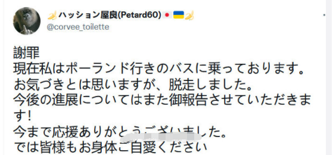

日本はウクライナ紛争の実情報の入手が困難な状態です。こちらの収集した情報と簡単な推測を共有します。

1. 「[東欧3首脳がキエフ訪問](https://www.nikkei.com/article/DGXZQOGR1609X0W2A310C2000000/)」が嘘です。一番あり得る場所はポーランドのアメリカ大使館である。  
    計画から終了までの数時間で、列車で戦争地域の訪問はあり得ません。ここまで鵜呑みするのは、救えないアホすぎる。
2. NATO、ウクライナはなぜ、傭兵が必要か？？？
    1. ロシアに勝てないから、NATO軍の派遣はできない。逆例、中東、アフガンの例を見ればよい。
    2. 直接、軍を派遣できないが、売り上げ確保のために、傭兵を雇って、国会から予算を確保する手段である
3. 露軍の攻撃を受けたNATO傭兵拠点は死体の山。プーチン、ロシア人を怒らせた因果応報である。  
    拠点だけではなく、キエフ等の都市部でも、多くの傭兵はドローンなどに殺された人は多い。
4. NATO傭兵について、情報筋からの展開内容
    1. 傭兵の目標は米国会の予算である。  
        死亡した場合、1人当たり80-100万ドルの賠償金の予算がでる。  
        このうち、20-30万？程度、遺族に振込の約束あるが、上手く手続きできなけらば、勿論、何もなし。
    2. ボーランド⇒ウクライナへ来た人は、ビザあるのでマシだが、ルーマニア等からウクライナへ入国した人は、ビザなしで、ボーランドから逃げれない人も多いらしい。
    3. 戦場への移動は、基本、歩行、又は、夜に点灯なしの車。  
        だから、上記の列車で「[東欧3首脳がキエフ訪問](https://www.nikkei.com/article/DGXZQOGR1609X0W2A310C2000000/)」が基本嘘である。
    4. 給料：270ドル/月、契約期限なし。契約は身売り証に近いもの。  
        勝手に撤退できるのは契約してない人だけ。  
        予算があるから、契約したら、勝手に帰れる事ができない(もちろん、英米等の人ならば、賄賂の抜き道がある。特にアジア系ならば、賄賂もだめらしい)
    5. 主な構成：
        1. 嘗てNATOで軍に参加したことがあって、しばらく通常生活に戻っても、困窮に陥った人
        2. 戦争とは何かを全く知らなく、SNSでファンを集めたく、インフルエンサーになりたい人
        3. 本能に少数だが、民主のために参加した人
    6. ブラックウォーター等、本当のプロな傭兵は基本、ウクライナに関与しない。
    7. 今のNATO傭兵は、実にはウクライナのような、本番の戦場での経験はだれもありません。嘗て経験あるとは、中東等、NATO空軍は無差別空爆した廃墟のなか、散在した男を殺して、女をレイプ、子供をナイフで殺して、人殺しの勇気を練習する。  
        ウクライナ戦場では、露軍から空爆されるので、多くの生還した傭兵は、涙と糞尿を漏らしながら逃げてしまうでしょう。  
        ⇒筆者も戦場に体験したことがなく、ミサイル爆発の迫力を想像できませんが、  
        さっきまで一緒に話をかけた人間は一瞬で肉の塊であっちこっちバラバラになって、脳みそや内臓は顔に飛び散るイメージを想像するだけでも、煉獄です。普通の人間はその場で崩壊するでしょう。
5. 戦場でスマホ使えない。  
    SNSで活躍してる傭兵は、基本、ボーランド国境付近以上に、戦場と離れてる。
    
    1. プロな傭兵はスマホを戦場へ持ち込まない
    2. 制電磁権と制空権ないNATO傭兵はスマホを持つだけで、電源OFFでも、直で、露軍に特定して殺す。

補足：↓こちら、日本人傭兵のアカウントに聞いてみようとしたら、昨日まであったのに、今日は検索してみたら、アカウント(corvee\_toilette)は「存在しません」と、なりました。なんでだろう？  
まだ、ウクライナで人を殺していないみたいので、ご無事で日本へ戻れるよう。

以下、戦場から逃げ出した米国と英国籍の傭兵です。  
ウクライナから武器なしで、戦場へ送られる証言をしてます。  
明らかに、戦ってもらうのではなく、死んでもらうことです。

https://twitter.com/MapsUkraine/status/1503882649819127809?s=20&t=6yIFIBV4CkFajX0O9rR3PA
