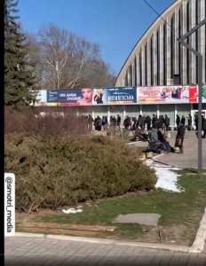
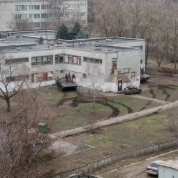
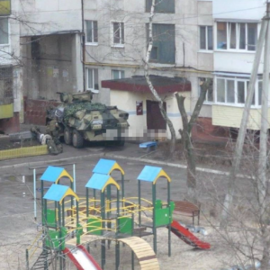
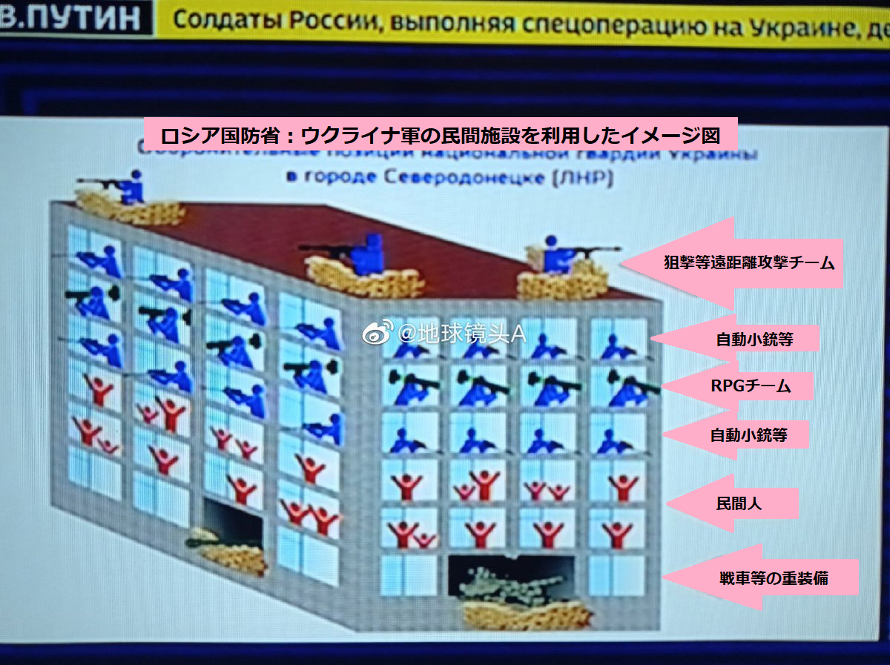
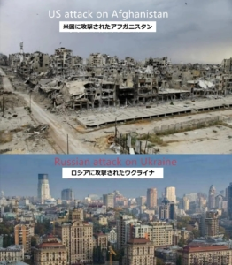
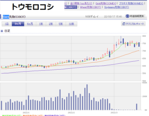
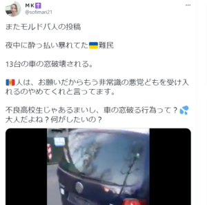
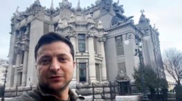

ロシア軍は、ウクライナでの特別軍事活動はなぜ、長く引いてるか？ 認知作戦の一環として、日本マスコミではウクライナ軍勝利とフェイクニュースを流してるが、今回、マスコミの嘘を暴き、散在された情報から、実状況をまとめます。

長く引いてる根本要因：

1. ウクライナ軍は民間施設に隠し、民間人を人間の盾にしてる
2. エネルギー、食糧など大口商品の産地として、見込めた欧米各国から制裁を見据えて、ロシアの利権の最大化を図る
3. ウクライナ難民を利用して、欧州と交渉で、ロシアの利権の最大化を図る
4. 宗教的な要因

実には、プーチンも早く進むな！と、軍に命令を下したようで、習近平の中国側も、ウクライナの状況を観測して、イスラム陣営、ロシアと団結して、米国と対抗していると見受けます。

上記の根本要因について、以下は展開して紹介します。

**1．ウクライナ軍は民間施設に隠し、民間人を人間の盾にしてる**

説明に入る前に、既に戦争が終わったヘルソン市、[露軍の支援物資配布を待つ行列](https://twitter.com/sofimari21/status/1503202495182430209)のキャプチャと、 リビア等、米軍、NATO軍により、イラク、リビア、イエメン、シリアを侵攻した前後の比較写真を見てください。

本題に入る前に、なぜ、戦争を経験したヘルソン市は戦争した跡が見えなく、米軍、NATO軍の攻撃したところは完全廃墟になったのか？とりあえず疑問してみてください。

上の比較写真からお分かっていただけたでしょうか。ロシア軍は民間人の死傷、民間施設の破壊をなるべく避けており、最小限に抑えようとしているわけだ。 こちらは、米軍、NATO軍の、都市ごとを廃墟にする、民間人を無視するやり方と、全然違います。

なぜ、ウクライナで民間人の死傷人数が多いか。要因は以下と思われます。

1. ウクライナ軍は東部で民間人を攻撃してる。 コンテンツは色々あるが、こちらは[ウクライナ軍の攻撃から生き残った10歳のキリルくんの動画](https://twitter.com/RusEmbassyJ/status/1503877750767366146?s=20&t=PGt75n7D9VWFj0Z7Z3L5ww)です。
2. ウクライナ軍は民間施設に武器、装備を隠してる。 以下は実際に取られた写真です。twitterにはウクライナ軍は住宅施設で、地雷を設置する映像もありました、消されたかわからないが、今は見当たりません。 [住民から、ウクライナ軍人向けに、戦車などの配備に抗議した映像を見つけました](https://twitter.com/loveapple/status/1498602850037174273?s=20&t=6zOP7rRwSjvMuQLLKuxLoA)。  
3. 戦闘中でも、ウクライナ軍は民間人を人間の盾にしてる。 以下はロシア国防総省からの説明画像です。民間ビルの中、民間人を真ん中の階にして、重装備と戦闘員を、下と上の階にすることで、ロシア軍は民間人の死傷を避けなくてはならないので、重武器を使えない。 

民間人は逃げればよいでは？と思うかもしれないが、実には、ウクライナ軍に止められて、簡単に逃げれません。隙間を見つけて、ロシア軍の助けを求めるのは、現地民間人の共通認識である。 ※[ロシア軍を祝福する人](https://twitter.com/sofimari21/status/1503744101069787143?s=20&t=VTfZziiGte6sbto1b_r-Tw) ※[脱出した市民はウクライナ軍に撃たれたことを暴く](https://twitter.com/mietobeangel926/status/1503267669520584704?s=20&t=VTfZziiGte6sbto1b_r-Tw) ※[ウクライナ軍の虐殺から逃げるハリコフ市民](https://twitter.com/sofimari21/status/1503180841039540227?s=20&t=VTfZziiGte6sbto1b_r-Tw)

ウクライナ軍により、軍備を民間人と民間施設に隠すことで、いくら配慮しても、戦争は戦争ですから、民間人の死傷は避けられません。 勿論、これで言い訳になりませんが、民間人の死傷を避けるために、ロシア軍はウクライナのナチズムの排除が用務である。

ロシア軍はマスコミに書かれた民間人無視のであれば、米軍を見習って、全員ネオナチのテロだと言えば、都市ごとを壊す方が、一番進みやすい。

アフガニスタンとウクライナの例を比較してみれば、すぐ分かるでしょう。

ロシアはウクライナでの特別作戦は、ウクライナ軍、ネオナチなどのナチズムの排除である。民間人はターゲットではないし、ウクライナ占領でもありません。

民間人の死傷を避けてるからこそ、重装備を使えなく、進みが遅い印象の要因の一つである。

**2．エネルギー、食糧など大口商品の産地として、見込めた欧米各国から制裁を見据えて、ロシアの利権の最大化を図る**

ロシアは大口商品の産地と輸出国ですから、ものの単価は収入が左右されます。 楽天証券からの先物取引の価格推移チャートを見ましょう。 数字を見れば、プーチンは裏側でニコニコした顔は想像できるでしょう。 情報元：https://www.rakuten-sec.co.jp/web/market/data/sc1.html

こちらは天然ガスと原油の価格変動チャートです。 天然ガスも原油も、年初からパイプライン関連の制裁の話が多く、高い数字を維持してます。 更に、日本もロシア制裁にかかわって、高くなったガソリン代は、皆さんご存じでしょう。 

エネルギーより、もっと困るのは食料です。 ウクライナもロシアも、世界中、重要な食糧産地である。しかも、戦争で、ウクライナのほとんどの地域は、春耕のタイミングを過ぎてしまったので、今年の農耕がなく、ウクライナの食料輸出は、殆どないと見込んでよいでしょう。

中東、欧州等、ウクライナから食料を輸入する地域は、ロシアから買わなくてはならないのか。明らかに、制裁できないところです。 因みに、我々、日本で生活してる人にも影響を与えるわけです。スーパーに並んでる数豊富な加工食品の原料を確認してみて下さい。主な原料は、基本、トウモロコシ、大豆、小麦等、数種類しかありません。   

エネルギーも、食料も、値段は馬鹿馬鹿しい上がってるが、産地のロシアに何が困るか？ 戦争が長く引いていくほど、これらの商品の単価が上がるので、ロシアは儲かるわけです。

**3．ウクライナ難民を利用して、欧州と交渉で、ロシアの利権の最大化を図る**

ウクライナから、おおよそ、[400万の難民](https://www.yomiuri.co.jp/world/20220307-OYT1T50016/)は欧州へ入ると予想されてます。ポーランドへ入国するには、1人あたり、100ドルで賄賂しなくてはならないので、この400万人は、少しお金を持つ、ミドル層以上の人と思われます。

まだ、2週間ほどしか経ってないので、大丈夫でしょうが、時間が経つと、余裕がなくなって、収入もない難民たちから、暴かれるのが当然です。実には、[今もSNS上で話題](https://twitter.com/sofimari21/status/1504241168665612289)となっているようです。

仕事の見つけやすいはずの西欧へ行けば？と思うかもしれないが、実には差別されるので、親戚がいるならばよいが、実には簡単ではありません。

ロシア軍は都市のほとんどの建物を壊さずに、そのまま残して、守っています。ネオナチ排除完了次第、ウクライナの難民はいつでも、帰国できるようになります。

では、ネオナチ排除はいつまでに終えるでしょう？プーチン次第、ようは、欧州から、どれくらいの利益を得られるか次第になるでしょう。

**4．宗教的な要因**

ロシア、キリスト教の東方正教の発祥地は、[キエフ大公国](https://ja.wikipedia.org/wiki/%E3%82%AD%E3%82%A8%E3%83%95%E5%A4%A7%E5%85%AC%E5%9B%BD)、今のキエフになります。キエフは正教徒の聖地である。イスラム、ユダヤ教にとって、エルサレムに当たる位置づけである。キエフのために、宗教戦争を興してもよいぐらいの位置づけであるから、プーチンのようなロシア民族主義者は、キエフの教会への崩壊は絶対許しません。

戦火でキエフを廃墟にすることも当然、極力避けたいわけです。今、マスコミで見えるキエフでの戦闘は、基本、近郊にあるもの理由が、中心部へ戦火を避けたい。しかも、[動画には重装備登場しないと、ドローンと言っても、DJI等、民間向けのものであること](https://news.yahoo.co.jp/articles/547d99e7e6d4e78d97da10bafb0594f633eeb878)、注目してほしいです。

**まとめ**

因みに、日本人にはあまりイメージしないと思うが、ゼレンスキーのキエフ動画の背景には、教会を映ってる意味の1つは、プーチンを怒らせるための挑発である。繫盛だった都市を廃墟にし、ウクライナ民間人をもっと殺してほしいこと、ゼレンスキーの言動とマスコミの煽るポイントからも、読めるはずかと思います。

ロシア軍にとって、絨毯爆撃は一番シンプル、損失が少ないはずですが、決して、ウクライナ占領、人殺しは、ロシア、プーチンの目的ではありません。通常のウクライナ人は、ロシア人にとって、家族のような存在であるからです。

プーチン、ロシアの軍人、ロシア人、日本の皆さん以上にウクライナと、ウクライナ人を愛してるわけです。 色々、政治、経済の面で展開してきたが、ぶっちゃけいうと、 ウクライナからナチズムとNATOを一掃して、平和なウクライナ、ロシアを取り戻そうとしてるのはプーチンの本当の目的である。時間がかかっても、やらなくてはならない。

(まだ、1か月も経ってないのに、長いと言えませんが…)

最後に、ウクライナの特別作戦、[イランの米国領事館攻撃](https://www.donga.com/jp/article/all/20220315/3251332/1)、次は、中国の台湾統一、全て、米国を孤立し、米ドル覇権崩壊の一環である。イスラム、ロシア、中国陣営は、一つ一つ、着実に実行しています。
