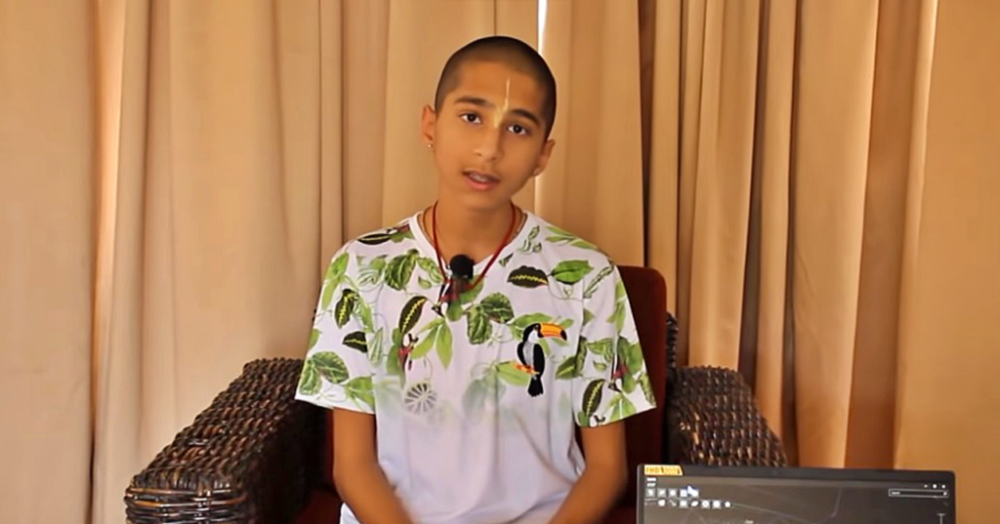

インドの占星術師、14歳のアビギャ・アナンドさんは、新型コロナを含めて、いろいろ予言されました。

直近、[4月に衝撃的な事件が起こる](https://enakyo-kh.jp/anando-yogen/)と予言されてます。

> 2022年初めから4月頃までは、景気が先行して回復していくでしょうと言っています。 でも、4月に衝撃的な事件が起こり、今後、数年間に渡り、影響を及ぼすことに注意しなければならないと言っています。

確かに、今年年初から、景気の回復は見えるでしょう。

目の前、4月ごろに起こりそうな事件として、 １．ウクライナ戦争は欧州への蔓延 2．台湾海峡の統一戦争

「1．」について、ロシアも、米国も、長期化を望んでいるだけで、欧州までの拡大が、中々、理由がなさそう。但し、4月ごろまでには、ウクライナ戦場は定着していく事は可能でしょう。 ウクライナ戦場は定着したら、「2．」が起こりえる。

台湾とはいえ、南シナ海、西太平洋を含めて、米国の覇権の存継にかかわるので、世界の地政学に深く及ぼすわけ。

何が起こるか分かりませんので、とりあえず、メモしておきたい。
