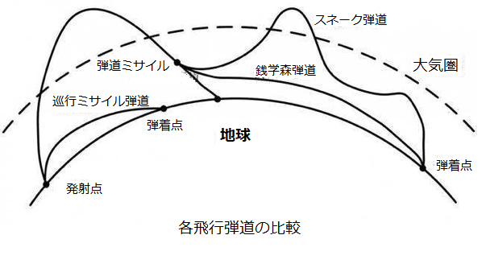

日本はウクライナ紛争の実情報の入手が困難な状態です。こちらの収集した情報と簡単な推測を共有します。

1. ゼレンスキー、ウクライナの放送局の発信、統一された内容の言論統制を強化。  
    [国民投票](https://jp.reuters.com/article/ukraine-crisis-zelenskiy-russia-idJPKCN2LI1T1)の準備か？
2. ゼレンスキーのバックグリーン映像がバレてるところが多くなってるため、西側の庶民はマスコミへの不信は増えてるようだ。
3. 台湾マスコミの報道、ウクライナ軍⇒モスクワ侵攻の直後にマリウポリ、キエフ、オデッサ等の包囲から、マスコミの嘘を気付く人は多くなってるようです。「もう、半分以上の人はマスコミを信じないでは？」と現地の人から言われた。
4. ロシア軍、内部から情報を漏洩する内通する人は多いと分かった。  
    参考：[俄罗斯动手抓内奸！普京发话后，又一名副司令被捕](https://new.qq.com/omn/20220318/20220318A012FQ00.html)
5. [ロシア黒海艦隊副司令官が戦死](https://japanese.joins.com/JArticle/289011)
6. 更に、極超音速ミサイルを使用
7. 極超音速ミサイルはなぜ、防衛手段ないか、下記、各飛行弾道の比較図から、基本的な仕組みを説明
    1. 従来のミサイルは、巡行ミサイルと弾道ミサイル。  
        巡航ミサイルは飛行機と同様な飛行跡であり、飛行速度も比較的遅く、超音速もマッハ2ほどであるので、防衛方法は、飛行機の防衛と同様で、勿論、小型飛行器への対応が必要。  
        弾道ミサイルの飛行跡が、名前通り、砲弾の弾道に沿ったものですから、発射された時点から、飛行跡は計算できるものである。PACシリーズの防空システムは、基本、弾道ミサイル向けのものである。
    2. 極超音速ミサイルというものは、スネーク弾道、又は、銭学森弾道で飛行するミサイルである。  
        一回、大気圏を出て、弾着点への飛行は不規則ので、飛行跡を予測できない点と、マッハ5を超えるスピードで、  
        弾道でもない、飛行機向けのミサイルより早いスピードで、現行の防空システムでは、基本、防衛できません。
    3. 「極超音速」の壁は、マッハ5、6以上のスピードだと、空気流体力学上、コントロールできなくなることである。  
        中露とも、この壁を乗り越えたから、極超音速ミサイルは実用化まで持ってきたわけ。
    4. 「極超音速」は速いか？  
        弾道ミサイルよい遅い。  
        弾道ミサイルは大気圏へ突入した後のスピードは、マッハ15-20のスピードは普通である。勿論、方向のコントロールも、基本出来ない。(中国のDF21D、DF26Bを除く)
        
        
        

補足：  
中国に警告すると以前から米国から脅かしたが、具体的に何か、言及されてない。  
原因調査中ですが、中国旅客機(ボーイング737-800)墜落事件は、非常に疑わしい。
