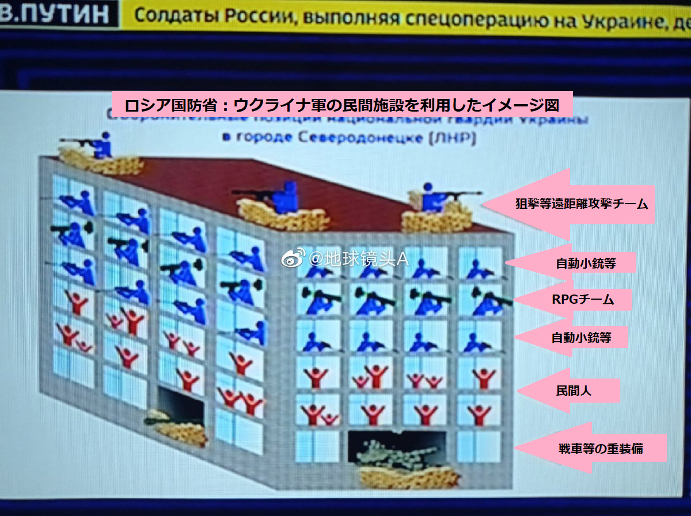

日本はウクライナ紛争の実情報の入手が困難な状態です。こちらの収集した情報と簡単な推測を共有します。

1. ロシアマスコミから、いったん発信して、削除された情報。 露軍の犠牲者数：9861
2. ロシア軍の予備役は4月に整え、ウクライナで決戦すると予想される。 関連：[アナンド最新予言！2022年4月に台湾統一戦争起こるのでしょうか？](https://blog.loveapple.cn/news/202203219592.html)
3. 米は直接軍を投入してないが、早期警戒機、人工衛星等、ウクライナ軍への支援は明らかである これを受け、ロシア軍の損失は大きい。
4. ロシア軍は生物兵器を使用するとのフェイクニュースを流れ始めたことは、 そろそろ、米軍は直接、ウクライナ戦場へ参入する予兆である。
5. 多くのウクライナ民間人はロシアへの避難に対して ⇒日本マスコミは、ロシア軍連行と報道
6. 以前、小児・産科病院の攻撃と言って、2人の犠牲した妊婦を演じた役者の女性は、 マリウポリで、ロシア軍から支援されたパンと水を元気で取りに行った映像は公開されました。 [https://vt.tiktok.com/ZSdLA9Ggq/](https://vt.tiktok.com/ZSdLA9Ggq/)
7. マリウポリなど、黒海沿岸都市の市街戦は進んでおり、民間人の犠牲も出ている。 日本マスコミの報道と真逆ですが、以下は、ウクライナ軍の、民間人の盾のやり方です。 ロシア軍は重武器を使えない要因でもある。 
