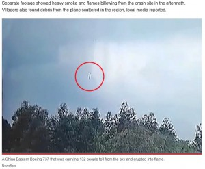
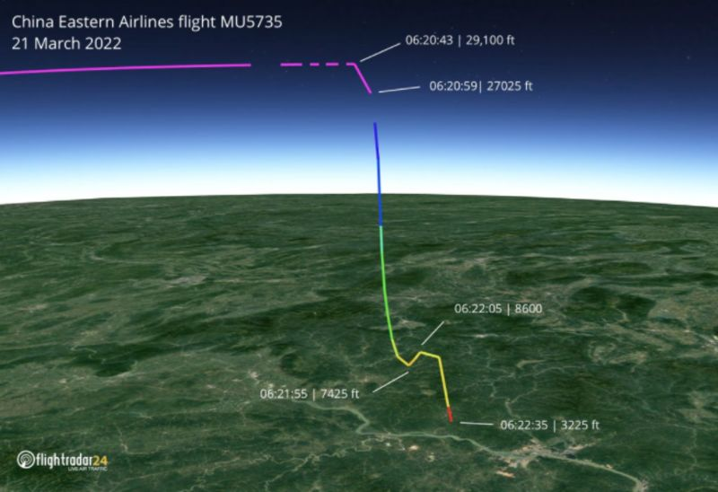
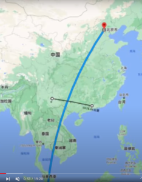

遭難された方とご家族に、お悔しみを申し上げたいと思います。 こちらは、陰謀論ではなく、真相を探りたく、陰謀を議論して、ただで死ぬじゃないと信じております。

正式な調査結果はこれからですが、現時点、こちらの推測した結果と言いますと、今回の事故は偶然ではなく、リモート操作により、興したサタニズムの献祭であり、アメリカの影の政府から、中国への宣戦布告である。

#### **事故の経緯と技術レベルの解析**

まず、[公式からのタイムライン](https://view.inews.qq.com/a/20220322A003LG00)のおさらい：

1. 3/21 午後1:10：昆明から、広州へ向かい、離陸
2. 3/21 午後2:15：連絡が絶えた
3. 3/21 午後2:19：巡行飛行高度、8869メートルから急降下し、速度845km/hから下げ
4. 3/21 午後2:20：飛行高度、8869.68メートル
5. 3/21 午後2:22：消失した時点、飛行高度、1333.5メートル
6. 3/21 午後4:34：転落と確認

しかも、監視カメラから、転落直前、ほぼ垂直で、[音速に近い速度](https://www.bloomberg.co.jp/news/articles/2022-03-23/R96XH8T1UM0X01)で、降下の映像が撮られました。

情報が少ない中、不明点が多いが、確実にわかったこと：

1. エンジンが通常稼働、もしくは、加速していた 飛行機はエンジン停止などの場合、[補助動力で、操縦、通信可能](https://happinesea.com/news/20200525943.html)ですから、「音速に近い速度」、「垂直」転落しない
2. 飛行機は解体、故障がない。 空中で解体した場合、落下の跡は放物線になります。 垂直とは、コントロールされたことを証明します。 むしろ、音速を出せたこそ、飛行機はかなり調子が良い状態である。
3. 連絡が絶えたタイミングまで、正常だったことは、事故の時点、外部への通信が遮断(?)された。
4. ボーイング社の旅客機のフライトコントローラーの機能として、パイロットの誤操作により、機体の極端な姿勢にすることを防ぐと、ハイジャックを防ぐと言って、同社から、遠距離操作は可能である。

疑問点：

1. 大型旅客機にあり得ない飛ばし方：音素に近い速度での巣直降下 ほぼ垂直で降下させる飛ばし方は、第二次世界大戦時代の急降下爆撃機以外、性能のよい戦闘機でも中々しない飛ばし方である。 更に、現代の旅客機のフライトコントローラー制御があるので、パイロットによる操作も不可能である。
2. 事故の報告がない パイロットは飛行機の異様に気づいたら、いち早く地上の管制と連絡するわけです。 ようは、事故が起こる直前まで、全ての計器は正常な数字を示した。 旅客機にとって、ありえない故障が起こったことを示す。

結論：

パイロットによる、人的なミス、機体の故障による制御不能の原因をほぼ排除できれば、ボーイング社によるリモート操作しか残っていません。

何でボーイングはここまでやるのか？ありえない！？と思うかもしれませんが、 今回の東方航空(MU5735)は単独な存在ではありません。 サタニズムの献祭と、アメリカの影の政府から、中国への宣戦布告である。

勿論、今回の事故は偶然ではありません。 ちょうど、[ボーイング737事故](https://ja.wikipedia.org/wiki/%E3%83%9C%E3%83%BC%E3%82%A4%E3%83%B3%E3%82%B0737%E5%9E%8B%E6%A9%9F%E3%81%AE%E4%BA%8B%E4%BB%B6%E3%83%BB%E4%BA%8B%E6%95%85%E4%B8%80%E8%A6%A7)一覧のページがあります。滑走路のオーバヘッド等、人的ミス、鳥にぶつける等の意外を除き、操縦不能など、制御系の事故は、基本、発展途上国か、米国と対立してる国で発生したものである。ようは、既に、事故を起こす試験は、何回も繰り返した可能性が非常に高いことである。

#### **サタニズムを表す情報**

3月21日、午後2時22分、搭乗客数123人(+乗員9名＝132人)⇒三つの数字の和：666、サタンを表す数字から注目してください。 事故の時間は、全て計算して、計画をたてられるものである。 搭乗者人数も、明らかに操作されたことは明らかです。

当日、元々、午前便の予定した家族3人は、いっぱいと言われて、[午後の、MU5735に移動](https://www.timednews.com/article/2022/03/23/16506.html)してもらいました。更に、同便の飛行直前に、1人が追い出されて、搭乗人数は、ちょうど、123人にされました。

これらの情報は偶然では？

中米対立での今、しかも、中国は米国のロシア制裁に反対すると明らかにした直後のタイミングでもある。ここから疑わしい。

今回の事故が発生したMU5735便とマレーシア航空370便の航路を、左図に示しました。 勿論、マレーシア航空370便も、「666」の情報を示してる。 ([更に666を隠した事件の考査](https://xn--w8j5cwb6a1433a427bijc90wdu1d.com/2020/07/13/number-666/))

> マレーシア航空370便失踪　2014年3月8日　2+1+4+3+8=18=666

十字架＋６６６、明らかにサタン表す情報である。

サタン教はユダヤ教の1つの分枝であり、アメリカの影の政府、ユダヤ財閥の信じる宗教となります。

ユダヤ人、ユダヤ財閥ははなぜ、欧州で嫌われて、ナチズムからのジェノサイドまで至っても、欧州の民衆はあまり反対しなかったか？要因の1つは、このサタン教を信じる人たちであるからだ。 今は、このサタンの信者たちは、アメリカの影の政府となって、世界各地で戦火を興し、大勢な庶民の犠牲で、大儲けをしています。

普通の人の価値観は、サタニズムに通用しません。

#### **まとめ**

人の少ない処で、こっそりと転落させようとしたでしょうが、監視カメラを設けた業者は、転落直前の映像をとれてしまった事、アメリカの影の政府の大誤算である。

何もなければ、ボーイング社は西側マスコミを使って、中国、東方航空のせいにすることはあり得るが、この映像だけでも、中国はボーイング社への全額請求可能な証拠になるでしょう。

もう、737MAXのところか？ボーイング社の全機種の旅客機は、中国航空会社による納入、飛行停止になる可能性が非常に高い。ロシア、中東の各航空社も、ボーイング機廃止まで、広がってもおかしくない。

リモート操作による興した事故だと分かっても、中国当局は直接発表する可能性が低い。 但し、米ドル覇権の崩壊、南シナ海、アジアから米国勢力の排除など、加速させ、しっかりと、やっていくことは間違いない。

因みに、直接、米国のリモート操作で123人を犠牲させたと発表したら、在日米軍基地にミサイルを撃ってもおかしくない状況になる。
