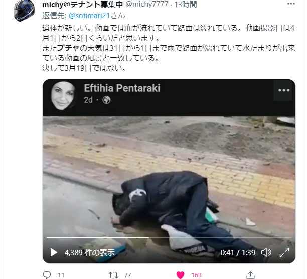

元ウクライナ検査官、ポクロンスカヤ氏はTelegramで、ブチャ虐殺事件について、分析した内容を共有します。  
私の見た情報元は[中国語](https://3g.163.com/dy/article/H4BQUJLE054391R8.html)です。ロシア語ができる方は、Telegramへどうぞ。

まず結論から言うと、同氏はロシアに対するすべての主張を信じません。

ロシア軍はブチャから撤退した後、ウクライナ当局は西側諸国の支持のした、ブチャ虐殺事件を大声で謳うが、  
露軍の撤退直後、ウクライナ国家親衛隊が同市へ進入し、直後にウクライナ当局の発表した写真の中では、街に遺体など、映っていなかった点に注目してください。被害者の死体が現れ始めたのは、その翌日である。

ロシア軍が同事件と関与しない証拠は他にも多々あるが、西側諸国のマスコミの洗脳、宣伝合戦は既に始まったので、ロシアに新たな制裁を実施しようとしてる。

西側マスコミとウクライナから公開された写真で物事を判断しようとしてる人には、この事件で誰が最大の受益者であるかと、考えてほしい。ブチャ虐殺事件に関与した人々は全く人間性がありません。ロシア人だけではなく、ウクライナ人に対しても、深い恨みを抱えてるわけだ。

本当にブチャ虐殺事件に関心を持つ人はよく考えてほしいところです。  
抑々、ロシア軍は民間人を虐殺する動機さえもありません。逆に、ウクライナ国家親衛隊と、いち早く現場へたどり着いたウクライナ保安庁には十分、虐殺の動機はあります。  
白いリボンを付けた被害者たちは、親ロシアであり、裏切り者として、市民を虐殺したのではないかと、過去の実績もあるし、この前、暴かれたウクライナ軍がブチャ市へ進入した時の対話からも証明できます。

筆者：  
ウクライナ軍は戦場ではまともに戦えないが、武器を持たない市民へのリンチ、虐殺の映像はたくさんあります。

https://twitter.com/sofimari21/status/1512241491048947714?s=20&t=YqgUJnJKx2kcUEvWyB9NhA
