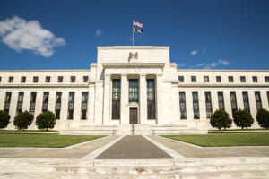
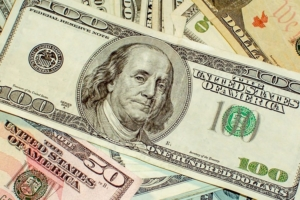

[5月、FRB利上げ](https://www.nikkei.com/article/DGXZQOGN06EUD0W2A400C2000000/?unlock=1)に備えて、円は爆発的に安くしている。色々不満な声は上がってるが、その主な理由は、米国はアジア資産の収穫の下準備である。有効かどうかは別だが、日本の立場でいうと、仕方のない自衛策でもある。

円が暴落してきて、今は[1ドル＝130円](https://www3.nhk.or.jp/news/html/20220420/k10013591641000.html)ほど、近い未来、1ドル＝180円と予測されてる専門家もいるらしい。 円は米ドル覇権において、世界から資産を収穫するツールの一つであり、今回の円安は米国の意図でもある。

何故、円安でアジア資産の収穫と、日本の自衛と言えるのか、今の情勢から分析したいと思います。

1．ウクライナ戦争で、ヨーロッパ全体は戦争の暗雲に覆われてる。大混乱中。 2．石油、天然ガス(LNG)をはじめ、エネルギー高騰。 3．今年後半から、貧困地域を含めて、欧州から、世界規模の食料不足見込み。 4．今の状況は続ければ、中国とロシアを除き、食料不足はアメリカまで広げる。

続いて、 ウクライナ戦争を興した本当の首謀はアメリカである。 欧州で戦争があれば、欧州での資金はアメリカへ流れるはずだが、[株価の指数](https://finance.yahoo.co.jp/quote/%5EDJI/chart?term=1y)などを見る限り、現状はうまくいかないようだ。逆に、[中国では2022年1-3月、外国からの投資額は25.6%増加](https://m.thepaper.cn/baijiahao_17634885)です。 ようは、ヨーロッパから出て、アメリカへ流れるはずの資金は、ヨーロッパのままで留めてるのか、中国などアジアへ流れてるか、あまり米国へ流れていないようだ。

**5月から、FRB利上げとは？**

今の世界経済においたドル覇権とは、FRBは金利の操作で、世界への投資、資金回収をコントロールします。

FRBの金利が低い時に米銀行から借金して、特に発展途上国へ投資する。米国内のインフレ等を抑える時、FRBは利上げして、借金を返済するために、発展途上国等、世界に投資した資産を売却して、米国に戻す。発展途上国から、大量な資金が消えてしまうため、金融危機が起こります。 発展途上国、金融危機にある世界中の資産は安くなってきたタイミングで、FRBは金利を下げ、米国の財閥はもう一回発展途上国へ戻って、高かった資産を激安の金額で入手して、このFRB金利の上下に合わせて、世界中の資産を高く売って、安く買う繰り返しです。

**米ドル覇権(金融覇権)**

OPEC諸国のエネルギー⇒中国、東南アジア諸国の実物の生産⇒日欧米のハイテック、今までは、すべての交易は米ドルベースなものである。アメリカはドルを刷るだけで、世界から資産を集める金融覇権(米ドル覇権)で、世界最強国を築いてきたわけです。

金融は生産しないが、リソースの最適化は金融の役割ですから、米国は金融覇権で、世界中の資産から、米利権の最大化は、最適化した結果である。

今現在、FRB利上げして、みんなはドルを買い集めてるタイミングですから、ドル高です。

但し、欧州から資産の収穫と決め、戦争を興して、適当にFRB利上げしても、アメリカは欧州以上に危ないと見受ける資産家は多いでしょうか、想定通りにアメリカへ戻ってこない、失算は現状である。

当面、ウクライナ戦争を長く引く、少なくとも、[長年で続くデマを流して](https://jbpress.ismedia.jp/articles/-/69559)、ロシア崩壊、中国の状況も芳しくない世論環境を作る。 次のステップはアジアで戦争を興すことである。 実にはすでにバイオ戦争を興してるわけです。 中国の吉林(食料産地)、深圳(ハイテック中心)、上海(金融、物流中心)、さらに、工作員等深く浸透してある上海では大混乱が起こってる結果、中国の2022年GDP成長率は目標の5.5%→4.8％下回ると予想される現状である。

バイオ戦争と合わせて、円安は特に注目したいところです。 FRB利上げの5月ごろ、中国も、東南アジアと同様に、パンデミックから回復しなければ、取り敢えず、資金を日本へ回ってもおかしくないでしょう。しかも、日本から、アジアへの投資も、円安の時期で、戻りやすいでしょう。 さらに、円安の中、日本に投資した資産は、抜けようとしても、なかなか難しくなります。こちらは、日本の自衛策ではないかと言ってます。 ただし、主権のない日本は円安以外の選択肢がないから、暴落の自衛方法しかありません。

FRBも欧州中央銀行も、主要経済圏の中央銀行の利息は高い水準なのに、日本銀行だけ、低金利のままからも、アメリカは日本から融資して、試験をアメリカへ戻す、結果的に、世界から資産を収穫することを実現するわけです。

**これからの円はどうなるか？**

今の円は避難通貨と言い難くなってるようですが、アジア金融危機、リーマンショックの過去事例を見ると、危機の1、2年後、円は安→高なります。

2023年4月、日銀総裁、黒田氏は任期満了して、[ポスト黒田は金融政策の転換に繋がる](https://www.sankei.com/article/20210920-IIGHQIQTYBMYFDT7IQKBXKAS5Q/)ようだ。 これから、世界の資金は思うとおりに日本へ流れたとして、日銀は今の低金利→金利を上げれば、また、みんなは円を買って、返済ブームになれば、円高に戻るでしょう。

但し、こちらはあくまで想定した内容です。実際のアジア情勢はかなり複雑である。

米の経済危機近づくのと、インフレが収まらないほど、米国はアジアで戦争を興すリスクが高くなります 台湾等、今まで放置してきた中国の領土問題の解決だけならば、戦争で米軍勢力をアジアから追い出すことにもつながるので、日本を含めて、アジア全体は良い局面へ進むでしょう。

最悪パターンは、中米露の全面戦争に至ると、日本は戦場になるので、別の話になります。 同時に中露と対抗する日本TOPの知恵ですから、リスクはゼロではありません。

**まとめ**

円安で、収入は上がってないので、物価高騰で、生活の品質は下がってしまう人は多くなり、不満がたまってるようです。 ドル覇権の下に、日本は欧州と同じ位置づけですから、WTO中心のグローバル経済の瓦解、米ドル覇権の崩壊に迎えてる過程で、一時的な混乱は必ずあります。 但し、日本は欧州ではありません。欧州の抱えてる移民問題、ロシアと紛争の問題はないはずです。 中国主導した、アジアからアメリカ勢力排除次第で、日本はアジアへ復帰するほど、新たな繁盛に迎えるでしょう。

米国と同盟だから無理でしょう？と思う人はいるでしょうが、 日本は同盟の盟主に忠実する国ではありません。歴史を見ればわかるが、利益が見える適切な時、低劣な裏切り者になります。 対抗中でも、中国は明らかに、米国の崩壊より、共存したいが、仮に米国は崩壊する日があるとしたら、日本が絶対、崩壊させる主力になります。だから、米ドル覇権の崩壊においても、日本が主力になるはずです。

**最後に**

この世界の未来はアジアである。 ルーブル、人民元主導の経済圏はすでに形成してる。 米ドル覇権による世界からの資産の収穫が、今回、最後かもしれません。 米ドル資産を持ってるならば、今は売るチャンスである。次回、価値は下がってしまった場合、永遠に上がらないかもしれません。 欧州も、米国も、内部の紛争が多く、内戦に近い状態です。
