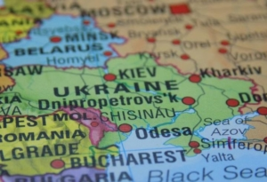

WHOのテドロス氏の[「中国のゼロコロナ政策持続できない」](https://news.yahoo.co.jp/articles/b0770bc3324004a9c036037f5e82d0710d99e951)の発言は日本でも反響が大きいのようで、こちらで、なぜ、中国は断固として、ゼロコロナ政策を持続しなくてはならないか、マスコミは絶対教えない理由を読者の皆さんに共有させていただきます。

**経済面**

まず、経済面から、ゼロコロナすべきかどうかで言うと、すべきです。

考えてほしいことは、仮に1日、誰も仕事しないとしたら、一番損失するのは誰か？ 仕事で儲かる人、アルバイトだったら、1日の給料がないだけで、それ以外、損と言えるものはありません。正社員だったら、基本、有給があるから、自由な時間があるので、逆に儲かる分け。 店の家賃、光熱費、社員を雇用する経営者たち、1日休みとは家、出費がともる事がありません。しかも、大手であるほど、損失は大きいわけ。 パンデミックの中、新型コロナに罹りやすい人たちとは、生活の為に人と接して稼がなくてはならない庶民である。お金持ちの経営者や、家族等、外出しなくても、コロナと共存と言って、必ず誰かやってくれるから、生活に困ることがありません。 仮に、利益が下がっても、やってくれる使用人がいる限り、お金持ちは安全である。

実は、withコロナという「共存」は、大手企業、富裕層の利益をちゃんと配慮した上の対策であること、おわかりいただけただろうか。

日欧米、資本主義の民主国家は、資本家、要は、財閥の利権を最優先してるから、「共存」させた場合、 勿論、経済成長の数字は維持できているように見えてるが、 貴方は飲食、生活必需品以外の小売り業者等、接客業であれば、「共存」させて本当に景気は良くなってると体験できますか？おそらく、厳しい状況のままだと答えた人は多数でしょう。

政府から支援があるから何とか維持できてる業者は多いが、国であろう、個人であろう、労働で創造した資産ではないから、借りたお金を何れ、返さなくてはならない。国が刷したお金ならば、最悪な状況じゃなくても、インフレになって、数倍に値する価値で返す可能性もある。

日本の「共存」でも、一時的に緩和されてるだけで、支援金も使い切る時期があるので、このままで続くと、経済がよくまわるわけがありません。

**医療面**

新型コロナ「共存」してよいと思う人は、基本、大型カゼだろうと勘違いする人は多いです。

但し、新型コロナは大型カゼだと謳い始めた人は誰か、覚えているのでしょうか？

元米大統領のトランプ氏です。医療従事者でもなく、感染病の専門家でもありません。 同氏の話を信じて、動物薬、洗剤を呑んでコロナを治そうとして、死んだり、病院に搬送されたりした信者もいました。

新型コロナはカゼではなく、罹った場合、[脳への影響は明ら](https://www.bbc.com/japanese/features-and-analysis-60702748)かである。抑々、後遺症といって、実際には治療できないから、直ちに命を落とさなくても、[症状の有無にかかわらず、体に残ります](https://news.yahoo.co.jp/articles/48be82098ab55be22032e71ec7e4867b9ab66039)。

因みに、最近、医療従事者を含めて、コロナは大型カゼだと謳う人は多いが、これらのお医者さんを含めて、大型カゼを治療できる人は一人もいません。簡単に脳、睾丸へ感染してしまう新型コロナには、手上げしかできません。

勿論、あなたはトランプ氏のように、億円単位でも出して、人のDNAに特化した特効薬を飲めるお金と人脈を持つなら、話は別になるでしょう。

**本当はバイオ戦争**

新型コロナは東亜人種(中国人)向けの生物兵器である。

デルタや、オミクロン等、新株前の調査結果ですが、英ケンブリッジ大学の調査結果によると、[東亜人種の死亡率は74.3%高い](https://blog.loveapple.cn/news/202107167128.html)と発表されました。

[ロシアはウクライナで米国の生物兵器実験場を大量に見つけた](https://news.yahoo.co.jp/articles/d85e367d327c4cec2b43562fdff61dd6ddecf089)報道からも分かるでしょう。

日本はPCR検査を控えてるので正確な数字は分かりませんが、2千万人口規模の台湾の1日5万人超えの感染数字からも、中国本土も「共存」したらどうなるか、見えるはずです。しかも、台湾の「5万人超え」の数字とは、あくまで自主検査で、本土の全員検査をしたら、もっと偉い数字になるわけです。

中国共産党政権は人民民主専制である。アメリカのような、百万人死んでも、日本のような、自主隔離と言って、たくさんの人が家で死んでも、国民は黙ってる国ではありません。

日欧米のように、国民の命は無駄にされたら、必ず反乱がおこる訳だ。「共存」させたら、中国共産党政権は、台湾に逃げた中国国民党と同様に、専制される対象になってもおかしくない。

**問題は本当に人権？**

上海のゼロコロナ政策について、文句を言う人、特に西側諸国のマスコミは、一番上げてるのは「人権」である。

中国の価値観でいう人権の大前提とは、生きる事である。死んだら何を語っても意味がありません。

納得しない外国の方は、何かしらのルートでもよいが、中国から去った方がよいでしょう。

但し、豪州など、上海から出たら、自国の豪州でもゴミ扱いで棄てられて、本当に死ぬかもしれないので注意を払った方がよい。日本でも、国民を含めて、入国制限があります。

人権について、絶対多数(90%以上？)その市民は文句がありません。基本、当局に協力してあげる姿勢である。

本当の問題は、米国のスパイ、内通者(汚職官吏等)により、起こした混乱である。

一例で言うと、今まで、全国から上海へ支援してきた物資は2400万トン、ようは、1人の市民あたり、約1トンの物資があるはずだが、実際に貰った物資は、1人当たり、10〜20kgほどだけ。

しかも、支援物資の転売、生鮮食品が臭くなるまで放置する地方の官吏等、次々と報道されてる状況である。

これらのスパイ、内通者は当局に清算されるでしょうが、マスコミに報道された人権などは、上海の本当の問題じゃないこと、理解していただければと思います。

しかも、ゼロコロナ政策は上海だけではなく、深セン、北京等、大都市を含めて、皆がゼロコロナ政策を実施して、最初の無知状態の武漢を含めて、上海のような混乱に陥った前例がありません。

**永遠に「ゼロコロナ」なのか？**

医療従事者ではなくても、抗生物質とかは分かると思います。ようは、西洋医学では、ウイルスと共存する考え方が、基本ありません。

なぜ、withコロナで「共存」、しかも、「戦略」という言葉まで、マスコミは使ってるかと、

「共存」したいわけではなく、対策がないから、「共存」「戦略」のような言葉で、合理的に聞こえると説明してるだけです。

実際にやってることは「共存」と「戦略」と関係なく、何もできないから、ウイルスを培養してるだけです。

こちらは、デルタ、オミクロン等、新しい変異株が次々と生まれてくる要因である。

抑々、ウイルスと共存する考え方は中国の中医の考え方である。

何れ、新型コロナウイルスと共存していくが、前述通り、今のは生物兵器であり、簡単に共存できません。

現時点、有効な対応方法は、中国のゼロコロナ政策のみである。

最終的に、収束に向けて、中国の不活化ワクチンと、中医の治療は大前提である。

**まとめ**

ここまで、中国はゼロコロナ政策が変わらない本当の理由を説明しました。

近い将来、中国は予防、治療の仕組みを整え次第、コロナと本当の共存する時代になります。 但し、今の日本などでいう「共存」とは、本当の共存ではなく、放置するだけであること、ご理解して頂ければ、パンデミックの下、ご自身、そして、ご家族を守るときに、何をすべきか、より、正確に判断できるかと思われます。
