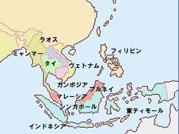

何故、日米は中国対抗のために、東南アジアでの施策は失敗を繰り返してるのか？ 東南アジア諸国は連動してるから、特に岸田首相は東南アジア訪問中で、[ミャンマーのガス田からENEOS撤退](https://www.asahi.com/articles/ASQ524VD4Q52ULFA00F.html)とは、直接言わなくても、実質上、日本と決裂したといってもよいでしょうか。

まず、経済上、中国は東南アジアの最大貿易相手である上、成長は継続している。 そして、米軍の軍事力が、中国軍と比べて、弱まってきたことで、米国の望ましくない国策を選んでも、イラク如く、いきなり侵略されることがありません。

最後に、根本的な所は、価値が異なるからです。 特にバイデン政権は主導した価値観外交では、東南アジア諸国の全員は、米国に滅ばれる対象である。

1. シンガポール：李氏家族の特栽政権
2. インドネシア：実質上の軍人独裁政権
3. カンボジア：軍の独裁政権
4. ベトナム：共産党政権、米国とのイデオロギーは敵対政権
5. ラオス：共産党政権、ベトナムと同様、米国の敵対政権
6. タイ：名目上の君主立憲制だが、実質上、軍の独裁政権
7. ミャンマー：軍人独裁政権
8. ブルネイ：君主独裁政権
9. フィリピン：家族政治、限られた政治家族の独裁政権

中国と旨く協力できれば、豊かになる明るい未来があるが、 中国と敵対、日米の言う通りにしたら、これらの国は永遠に米国の奴隷になり、日本は奴隷たちの代理人と言った位置づけ、戦後の状況に戻ってしまうことである。

独裁、ワンマンの政治であるこそ、反対が少なく、最善な方向を選べるから、今の状況に至ったでしょう。
