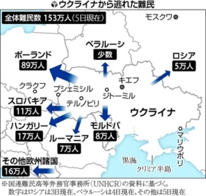

[ウクライナから国外への難民数は600万](https://twitter.com/i/events/1494972325669715970)、とは、欧州経済の崩壊を読み替えてよいでしょう。

ウクライナは欧州で最貧困な国であり、豊かな欧米へ行くのは、多くの人の願望だったが、 平和だった時、貧しい人を通関で止められるので、ウク戦争のきっかけで、皆は豊かな欧州へ、自由に行けるチャンスとなっているわけだ。 実際に、旅費が高いので、米国、日本へ行ける人が少なく、西側からの迫害を懸念する以外、殆どの人は、陸から簡単に行ける欧州へ行きます。

せっかく、貧しいウクライナから脱出できた人は、簡単に戻ることなく、欧州に残ります。 しかも、通常、欧州へ行ったら収入なしで生きられないので、難民だったら、[欧州](https://www.eeas.europa.eu/delegations/japan/eu-%E7%90%86%E4%BA%8B%E4%BC%9A%E3%80%81%E3%82%A6%E3%82%AF%E3%83%A9%E3%82%A4%E3%83%8A%E9%9B%A3%E6%B0%91%E5%8F%97%E3%81%91%E5%85%A5%E3%82%8C%E3%81%AE%E3%81%9F%E3%82%81%E3%80%8135-%E5%84%84%E3%83%A6%E3%83%BC%E3%83%AD%E3%81%AE%E8%BF%BD%E5%8A%A0%E8%B3%87%E9%87%91%E3%82%92%E7%94%A8%E6%84%8F_ja?s=169)、[イギリス](https://www.jetro.go.jp/biznews/2022/03/3f2711e37230b9b9.html)の政府から補助はでます。 勿論、補助とは政府の財政からでるので、難民へ振り分けたら、自国民への補助が減るわけです。

日本マスコミはまだ報道されていないようだが、イギリス、[ジョンソン首相は、財政負担を削減するために、9.1万の公務員を解雇すると検討を始めた](https://www.163.com/dy/article/H78Q2JRH053469M5.html?f=post2020_dy_recommends)。

日本の公務員は、国家資格を取得した上、採用するのは一般的でしょうが、 イギリスの場合、普通の仕事ができない知力や、体が不自由な人を雇って、社会の負担を減るのが一般的だそうです。

イギリスの9.1万公務員解雇とは、明らかに、政府財政の破綻が見えてしまったことである。

因みに、難民は普通の入国した外国人とどう違うのか？日本にいる皆さんはあまりイメージしないでしょうが、この人たちは現地の人から仕事を奪う一方、通常の留学生、就職者等の外国人と異なって、現地の習慣、ルール、法律等を理解しようとする人の割合が少ないのである。 だから、社会的な混乱、元々よくない治安の悪化は必至である。

更に、エネルギー不足、この先の食料不足の加味で、イギリスなど、欧州内部は大変な状況に直面してる。

自分の主張を繰り返すが、今は、欧州経済崩壊の寸前である。ロシアと対立してる中、活躍してるイギリスは特に危ない。資産を持つなら、損でも、素早く手放すべきだ。 イギリス大好きなアラビアのお金持ちたちは、既に撤退中だそうです。
