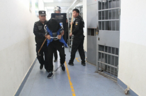
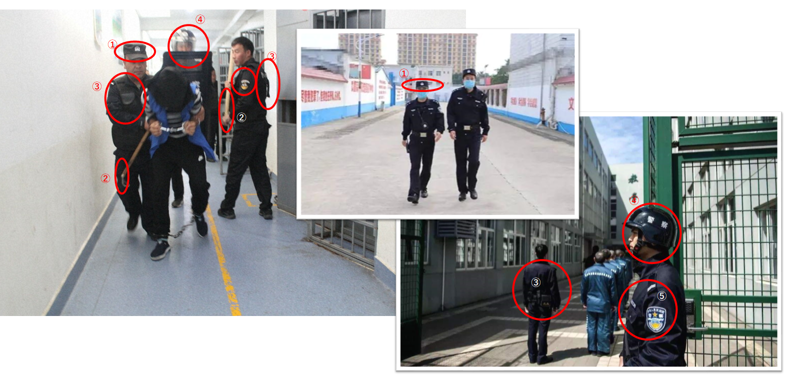
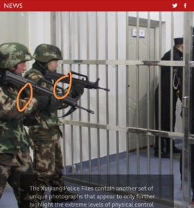
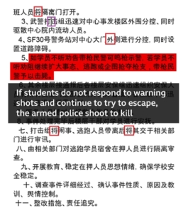

中国対抗の打つ手がなくなった時期、もしくは、中国と何かしらの協議をやろうとする直前、欧州は新疆をはじめ、中国の人権問題のデマを大量に流して、中国当局と交渉するネタを作ります。

勿論、デマを流す目的はどこかの人権改善のためにではありません。日欧米、各国政府は、本気で人権をよくしようとしたら、まず、各自国内の人種問題を解決すべきだし、他国に、戦禍を送らなければ、世界は基本平和でしょう。

今回、日本のマスコミで流してる写真をベースに、デマを暴きます。

まず、こちら、[各ニュースサイトで挙げられた写真](https://mainichi.jp/articles/20220524/k00/00m/030/019000c)です。

中国のことをあまり知らない人は簡単に信じてしまいそうな写真ですが、よく見ると、偽造写真だとすぐにバレてしまいます。

中国では、まちで、普通にパトロールする警察と、刑務所で、犯人を管理する武装警察は、別々のシステムとなります。  
また、刑務所は独特な環境であり、普通の警察は使用する保護グッズは簡単に手に入らないかもしれません。

以下、常識レベルで、違いをまとめました。

1. 写真の左の太い人の帽子を注目してください。  
    頭が大きい一方、帽子が小さくて被れない。  
    中国の警察、特に武装警察は、軍と同等ですから、米軍と異なって、適当な服装はダメです。こんな帽子の被り方は基本アウト。
2. 木の警棒に注目してください。  
    警備員ならわかるが、中国の警察は木の警棒を使いません。  
    インド、日本の警察ではありませんから。
3. 防弾チョッキらしいのジャケットは、怪しい。  
    刑務所の中には誰もガンを持たないから、何故、防弾チョッキを使うのか？  
    アメリカ警察でも、基本、ないでしょう。  
    合わせて、右側の写真を参考してください。  
    実に、刑務所の警察は防弾チョッキを使わないこと、明らかです。
4. ヘルメットと盾が怪しすぎる。  
    騒動など、ビンや石など、投げられてくるから、写真の中に映ってるものらしいヘルメットと盾の姿はあるでしょうが、  
    この方向、この環境の中では、余計にヘルメットと盾にする意味とは何か説明できますか？  
    右側の写真を参考してください。刑務所で使うヘルメットのスタイルは違うらしい。
5. 最後、やっぱりエンブレムが怪しい。  
    恐らく、はっきり見えないように、写真はきれいに撮っていないが、  
    右側の本物と比べると、やっぱり違和感があります。

全体的に警察の写真について、一点注目してほしいのは、番号札が写真に写らないことです。  
通常の警察の写真ならば、分かりやすく見せるが、偽造写真ならわざわざ隠します。  
理由は簡単です。番号があったら、実在するかどうか、素人でもすぐ分かってしまうからです。

**他にもいろいろある訳**

マスコミは公開された所謂、新疆の人権侵害の写真などの資料は、フェイク(偽情報)しかありません。

勿論、文書も捏造されたものです。  
漢字の書き方で、気づいた鋭い人はいます。

今までは、台湾発のものは多かったが、何故か、今回はの偽情報は日本製らしいです。日本の人件費は下がったのか？分かりません。

最近、日本のマスコミはフェイクニュースだらけで、仕方ありません。

中国の警察、武装警察の仕組みに精通しませんので、本当に常識レベルの話ですが、プロの方ならば、もっと、たくさんの点を気づくと思います。

何故、こんな悪質なデマを流すのか？  
冒頭に話した通り、経済危機、食糧危機、悪質インフレに陥る日欧米各国は、中国と交渉したいからでしょう。

残念だけど、こんなことで、中国は相手にしないではありませんか。

https://twitter.com/xiaojianjun/status/1529131421276999680?s=20&t=I6hBUvnh1RLGGE4J-vJdgg
